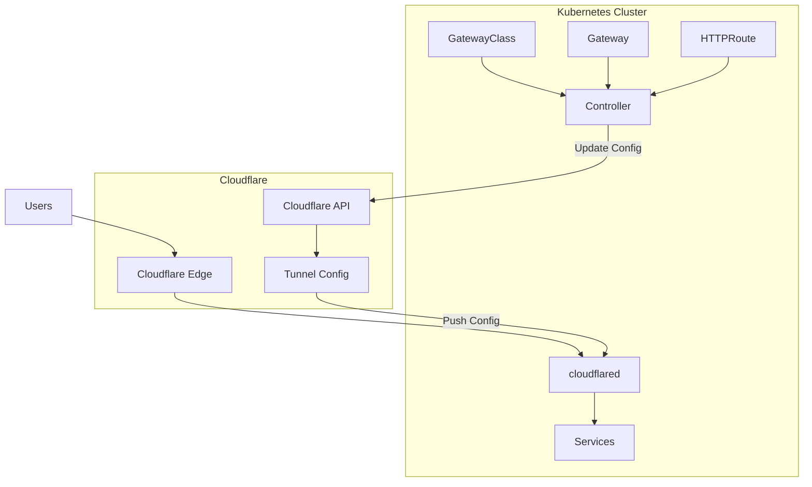

# Cloudflare Tunnel Gateway Controller

[](https://go.dev/)
[](LICENSE)
[](https://github.com/lexfrei/cloudflare-tunnel-gateway-controller/releases)
[](https://github.com/lexfrei/cloudflare-tunnel-gateway-controller/actions/workflows/pr.yaml)

Kubernetes controller implementing Gateway API for Cloudflare Tunnel.

Enables routing traffic through Cloudflare Tunnel using standard Gateway API resources (Gateway, HTTPRoute).

## Features

- Standard Gateway API implementation (GatewayClass, Gateway, HTTPRoute)
- Hot reload of tunnel configuration (no cloudflared restart required)
- Optional cloudflared lifecycle management via Helm SDK
- Leader election for high availability deployments
- Multi-arch container images (amd64, arm64)
- Signed container images with cosign

## Quick Start

```bash
# 1. Install Gateway API CRDs
kubectl apply -f https://github.com/kubernetes-sigs/gateway-api/releases/download/v1.2.0/standard-install.yaml

# 2. Add Helm repository
helm registry login ghcr.io

# 3. Install the controller
helm install cloudflare-tunnel-gateway-controller \
  oci://ghcr.io/lexfrei/cloudflare-tunnel-gateway-controller/cloudflare-tunnel-gateway-controller \
  --namespace cloudflare-tunnel-system \
  --create-namespace \
  --set config.tunnelID=YOUR_TUNNEL_ID \
  --set config.apiToken=YOUR_API_TOKEN

# 4. Create HTTPRoute to expose your service
kubectl apply -f - <<EOF
apiVersion: gateway.networking.k8s.io/v1
kind: HTTPRoute
metadata:
  name: my-app
spec:
  parentRefs:
    - name: cloudflare-tunnel
      namespace: cloudflare-tunnel-system
  hostnames:
    - app.example.com
  rules:
    - backendRefs:
        - name: my-service
          port: 80
EOF
```

See [Installation](#installation) for detailed setup instructions.

## Prerequisites

- Kubernetes cluster with Gateway API CRDs installed
- Cloudflare account with a pre-created Cloudflare Tunnel
- Cloudflare API token with tunnel permissions

### Create Cloudflare Tunnel

Before deploying the controller, you must create a Cloudflare Tunnel:

1. Go to [Cloudflare Zero Trust Dashboard](https://one.dash.cloudflare.com/)
2. Navigate to **Networks** > **Tunnels**
3. Click **Create a tunnel**
4. Choose **Cloudflared** connector type
5. Name your tunnel and save the **Tunnel ID** and **Tunnel Token**

The controller manages tunnel ingress configuration via API. You can either:

- Let the controller deploy cloudflared automatically (`--manage-cloudflared=true`)
- Deploy cloudflared yourself using the tunnel token

### Cloudflare API Token Permissions

Create an API token at [Cloudflare API Tokens](https://dash.cloudflare.com/profile/api-tokens) with the following permissions:

| Scope | Permission | Access |
|-------|------------|--------|
| Account | Cloudflare Tunnel | Edit |
| Account | Cloudflare Tunnel | Read |
| Account | Account Settings | Read |

The **Account Settings: Read** permission is required for auto-detecting the Account ID when not explicitly provided.

## Installation

### Helm (Recommended)

```bash
helm install cloudflare-tunnel-gateway-controller \
  oci://ghcr.io/lexfrei/cloudflare-tunnel-gateway-controller/cloudflare-tunnel-gateway-controller \
  --namespace cloudflare-tunnel-system \
  --create-namespace \
  --values values.yaml
```

See [charts/cloudflare-tunnel-gateway-controller/README.md](charts/cloudflare-tunnel-gateway-controller/README.md) for all configuration options.

### Manual Installation

#### 1. Install Gateway API CRDs

```bash
kubectl apply -f https://github.com/kubernetes-sigs/gateway-api/releases/download/v1.2.0/standard-install.yaml
```

#### 2. Create namespace

```bash
kubectl create namespace cloudflare-tunnel-system
```

#### 3. Configure credentials

Edit `deploy/controller/deployment.yaml` and set your values in ConfigMap and Secret:

- `tunnel-id`: Your Cloudflare tunnel ID
- `api-token`: Your Cloudflare API token
- `account-id`: (optional) Your Cloudflare account ID - auto-detected if token has access to single account
- `cluster-domain`: Your cluster domain (default: `cluster.local`)

#### 4. Deploy the controller

```bash
kubectl apply -f deploy/rbac/
kubectl apply -f deploy/controller/
```

#### 5. Create GatewayClass and Gateway

```bash
kubectl apply -f deploy/samples/gatewayclass.yaml
kubectl apply -f deploy/samples/gateway.yaml
```

## Usage

Create an HTTPRoute to expose your service through Cloudflare Tunnel:

```yaml
apiVersion: gateway.networking.k8s.io/v1
kind: HTTPRoute
metadata:
  name: my-app
  namespace: default
spec:
  parentRefs:
    - name: cloudflare-tunnel
      namespace: cloudflare-tunnel-system
  hostnames:
    - app.example.com
  rules:
    - matches:
        - path:
            type: PathPrefix
            value: /
      backendRefs:
        - name: my-service
          port: 80
```

The controller will automatically update Cloudflare Tunnel configuration. Changes are applied instantly without restarting cloudflared.

**Important:** On startup, the controller performs a full synchronization of the tunnel configuration. This means:

- All existing ingress rules in the tunnel are replaced with rules derived from current HTTPRoutes
- Any rules created outside of this controller will be removed
- This ensures the tunnel configuration is always consistent with Kubernetes resources

## External-DNS Integration

The controller integrates with [external-dns](https://github.com/kubernetes-sigs/external-dns) for automatic DNS record creation.

The controller automatically sets `status.addresses` on the Gateway with the tunnel CNAME (`TUNNEL_ID.cfargotunnel.com`). External-dns reads this value as the DNS target.

### Gateway Configuration

```yaml
apiVersion: gateway.networking.k8s.io/v1
kind: Gateway
metadata:
  name: cloudflare-tunnel
  namespace: cloudflare-tunnel-system
spec:
  gatewayClassName: cloudflare-tunnel
  listeners:
    - name: http
      port: 80
      protocol: HTTP
      allowedRoutes:
        namespaces:
          from: All
```

### HTTPRoute Configuration

Add provider-specific annotations on HTTPRoute:

```yaml
apiVersion: gateway.networking.k8s.io/v1
kind: HTTPRoute
metadata:
  name: my-app
  annotations:
    external-dns.alpha.kubernetes.io/cloudflare-proxied: "true"
spec:
  parentRefs:
    - name: cloudflare-tunnel
      namespace: cloudflare-tunnel-system
      sectionName: http  # Must match listener name
  hostnames:
    - app.example.com
```

**Important:** The `sectionName` in parentRef must match the listener name in Gateway for external-dns to properly associate routes with the gateway.

## Configuration

| Flag | Environment Variable | Default | Description |
|------|---------------------|---------|-------------|
| `--account-id` | `CF_ACCOUNT_ID` | (auto-detect) | Cloudflare account ID |
| `--tunnel-id` | `CF_TUNNEL_ID` | | Cloudflare tunnel ID |
| `--api-token` | `CF_API_TOKEN` | | Cloudflare API token |
| `--cluster-domain` | `CF_CLUSTER_DOMAIN` | `cluster.local` | Kubernetes cluster domain |
| `--gateway-class-name` | `CF_GATEWAY_CLASS_NAME` | `cloudflare-tunnel` | GatewayClass name to watch |
| `--controller-name` | `CF_CONTROLLER_NAME` | `cloudflare.com/tunnel-controller` | Controller name |
| `--metrics-addr` | `CF_METRICS_ADDR` | `:8080` | Metrics endpoint address |
| `--health-addr` | `CF_HEALTH_ADDR` | `:8081` | Health probe endpoint address |
| `--log-level` | `CF_LOG_LEVEL` | `info` | Log level (debug, info, warn, error) |
| `--log-format` | `CF_LOG_FORMAT` | `json` | Log format (json, text) |
| `--manage-cloudflared` | `CF_MANAGE_CLOUDFLARED` | `false` | Deploy and manage cloudflared via Helm |
| `--tunnel-token` | `CF_TUNNEL_TOKEN` | | Tunnel token for remote-managed mode |
| `--cloudflared-namespace` | `CF_CLOUDFLARED_NAMESPACE` | `cloudflare-tunnel-system` | Namespace for cloudflared |
| `--cloudflared-protocol` | `CF_CLOUDFLARED_PROTOCOL` | | Transport protocol (auto, quic, http2) |
| `--leader-elect` | | `false` | Enable leader election for HA |
| `--leader-election-namespace` | | | Namespace for leader election lease |
| `--leader-election-name` | | `cloudflare-tunnel-gateway-controller-leader` | Leader election lease name |

## Architecture



### How It Works

1. **Watch**: Controller watches Gateway API resources (GatewayClass, Gateway, HTTPRoute)
2. **Convert**: HTTPRoutes are converted to Cloudflare Tunnel ingress rules
3. **Sync**: Configuration is pushed to Cloudflare API
4. **Apply**: cloudflared receives updated config automatically (hot reload)

## Documentation

| Document | Description |
|----------|-------------|
| [Architecture](docs/ARCHITECTURE.md) | System architecture and design decisions |
| [Gateway API](docs/GATEWAY_API.md) | Supported Gateway API features and limitations |
| [Metrics](docs/METRICS.md) | Prometheus metrics, alerting rules, Grafana dashboard |
| [Development](docs/DEVELOPMENT.md) | Development setup and contributing guide |
| [Troubleshooting](docs/TROUBLESHOOTING.md) | Common issues and solutions |
| [Helm Chart](charts/cloudflare-tunnel-gateway-controller/README.md) | Helm chart configuration reference |

## Contributing

Contributions are welcome! Please read [CONTRIBUTING.md](CONTRIBUTING.md) for guidelines.

## Security

For security issues, please see [SECURITY.md](SECURITY.md).

## License

BSD 3-Clause License - see [LICENSE](LICENSE) for details.
