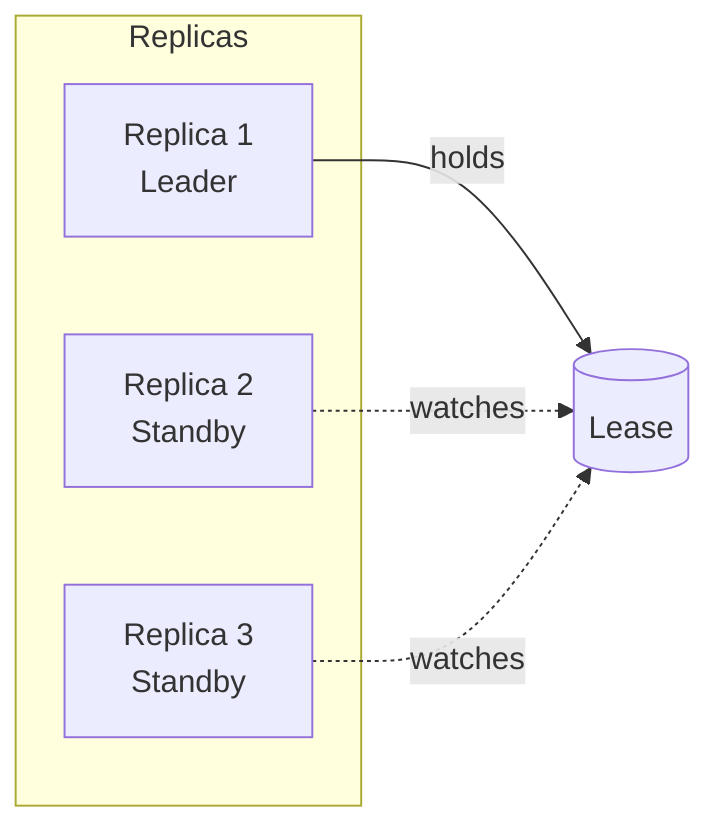

# Controller Options

This document describes all configuration options for the controller binary.
For Helm chart values, see [Helm Values](helm-values.md).

## Command Line Flags

| Flag | Environment Variable | Default | Description |
|------|---------------------|---------|-------------|
| `--gateway-class-name` | `CF_GATEWAY_CLASS_NAME` | `cloudflare-tunnel` | GatewayClass name to watch |
| `--controller-name` | `CF_CONTROLLER_NAME` | `cf.k8s.lex.la/tunnel-controller` | Controller name for GatewayClass |
| `--cluster-domain` | `CF_CLUSTER_DOMAIN` | (auto-detect) | Kubernetes cluster domain |
| `--metrics-addr` | `CF_METRICS_ADDR` | `:8080` | Metrics endpoint address |
| `--health-addr` | `CF_HEALTH_ADDR` | `:8081` | Health probe endpoint address |
| `--log-level` | `CF_LOG_LEVEL` | `info` | Log level (debug, info, warn, error) |
| `--log-format` | `CF_LOG_FORMAT` | `json` | Log format (json, text) |
| `--leader-elect` | `CF_LEADER_ELECT` | `false` | Enable leader election for HA |
| `--leader-election-namespace` | `CF_LEADER_ELECTION_NAMESPACE` | | Namespace for leader election lease |
| `--leader-election-name` | `CF_LEADER_ELECTION_NAME` | `cloudflare-tunnel-gateway-controller-leader` | Leader election lease name |

## Environment Variables

All flags can be set via environment variables with the `CF_` prefix.
Dashes in flag names are replaced with underscores.

Examples:

- `--gateway-class-name` → `CF_GATEWAY_CLASS_NAME`
- `--log-level` → `CF_LOG_LEVEL`
- `--leader-elect` → `CF_LEADER_ELECT`

## Cluster Domain Auto-Detection

The controller automatically detects the Kubernetes cluster domain from
`/etc/resolv.conf` search domains. If detection fails, it falls back to
`cluster.local`.

To override auto-detection:

```bash
--cluster-domain=my-cluster.local
```

Or via environment variable:

```bash
CF_CLUSTER_DOMAIN=my-cluster.local
```

## Leader Election

For high availability deployments with multiple controller replicas,
enable leader election:

```bash
--leader-elect=true
--leader-election-namespace=cloudflare-tunnel-system
```

Only the leader processes events; other replicas remain on standby for
automatic failover.



## Logging

### Log Levels

| Level | Description |
|-------|-------------|
| `debug` | Detailed debugging information |
| `info` | Normal operational messages |
| `warn` | Warning conditions |
| `error` | Error conditions |

### Log Formats

| Format | Description |
|--------|-------------|
| `json` | Structured JSON logs (recommended for production) |
| `text` | Human-readable text logs (useful for development) |

Example JSON log:

```json
{
  "level": "info",
  "ts": "2024-01-15T10:30:00Z",
  "msg": "HTTPRoute reconciled",
  "route": "default/my-app",
  "hostnames": ["app.example.com"]
}
```

## Health Endpoints

The controller exposes health endpoints for Kubernetes probes:

| Endpoint | Port | Description |
|----------|------|-------------|
| `/healthz` | 8081 | Liveness probe |
| `/readyz` | 8081 | Readiness probe |

These are used by Kubernetes to determine pod health:

```yaml
livenessProbe:
  httpGet:
    path: /healthz
    port: 8081
readinessProbe:
  httpGet:
    path: /readyz
    port: 8081
```

## Metrics Endpoint

The controller exposes Prometheus metrics on the metrics port:

| Endpoint | Port | Description |
|----------|------|-------------|
| `/metrics` | 8080 | Prometheus metrics |

See [Metrics & Alerting](../operations/metrics.md) for available metrics.
