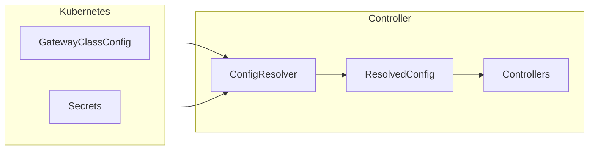

# GatewayClassConfig

GatewayClassConfig is a cluster-scoped Custom Resource Definition (CRD) that
provides tunnel configuration for the controller.

## Overview

The GatewayClassConfig is referenced by a GatewayClass via `spec.parametersRef`
and contains:

- Cloudflare credentials (API token, tunnel token)
- Tunnel ID
- cloudflared deployment settings
- AmneziaWG sidecar configuration (optional)

## API Reference

```yaml
apiVersion: cf.k8s.lex.la/v1alpha1
kind: GatewayClassConfig
metadata:
  name: cloudflare-tunnel-config
spec:
  # Required: Cloudflare Tunnel UUID
  tunnelID: "550e8400-e29b-41d4-a716-446655440000"

  # Optional: Cloudflare Account ID (auto-detected if not specified)
  accountID: "1234567890abcdef"

  # Required: Reference to Secret containing API token
  cloudflareCredentialsSecretRef:
    name: cloudflare-credentials
    # key: api-token  # Default: "api-token"

  # Required when cloudflared.enabled=true: Tunnel token for cloudflared
  tunnelTokenSecretRef:
    name: cloudflare-tunnel-token
    # key: tunnel-token  # Default: "tunnel-token"

  # cloudflared deployment configuration
  cloudflared:
    enabled: true  # Default: true

    # AmneziaWG sidecar (optional)
    awg:
      secretName: awg-config
```

## Field Reference

### `spec.tunnelID` (required)

The UUID of the Cloudflare Tunnel. You can find this in the Cloudflare Zero
Trust dashboard under Networks > Tunnels.

```yaml
spec:
  tunnelID: "550e8400-e29b-41d4-a716-446655440000"
```

### `spec.accountID` (optional)

The Cloudflare account ID. If not specified, it is auto-detected from the API
token when the token has access to a single account.

```yaml
spec:
  accountID: "1234567890abcdef"
```

### `spec.cloudflareCredentialsSecretRef` (required)

Reference to a Kubernetes Secret containing the Cloudflare API token.

```yaml
spec:
  cloudflareCredentialsSecretRef:
    name: cloudflare-credentials
    key: api-token  # Optional, defaults to "api-token"
```

The referenced Secret must exist in the same namespace as the controller:

```yaml
apiVersion: v1
kind: Secret
metadata:
  name: cloudflare-credentials
  namespace: cloudflare-tunnel-system
type: Opaque
stringData:
  api-token: "YOUR_API_TOKEN"
```

### `spec.tunnelTokenSecretRef` (required when `cloudflared.enabled=true`)

Reference to a Kubernetes Secret containing the tunnel token for cloudflared.

```yaml
spec:
  tunnelTokenSecretRef:
    name: cloudflare-tunnel-token
    key: tunnel-token  # Optional, defaults to "tunnel-token"
```

### `spec.cloudflared` (optional)

Configuration for the cloudflared deployment.

#### `spec.cloudflared.enabled`

Whether the controller should deploy cloudflared via Helm. Default: `true`.

Set to `false` if you manage cloudflared externally.

#### `spec.cloudflared.awg.secretName`

Name of the Secret containing AmneziaWG configuration for traffic obfuscation.

See [AmneziaWG Sidecar Guide](../guides/awg-sidecar.md) for details.

## GatewayClass Reference

The GatewayClass references the GatewayClassConfig via `parametersRef`:

```yaml
apiVersion: gateway.networking.k8s.io/v1
kind: GatewayClass
metadata:
  name: cloudflare-tunnel
spec:
  controllerName: cf.k8s.lex.la/tunnel-controller
  parametersRef:
    group: cf.k8s.lex.la
    kind: GatewayClassConfig
    name: cloudflare-tunnel-config
```

## Complete Example

```yaml
---
apiVersion: v1
kind: Secret
metadata:
  name: cloudflare-credentials
  namespace: cloudflare-tunnel-system
type: Opaque
stringData:
  api-token: "YOUR_API_TOKEN"
---
apiVersion: v1
kind: Secret
metadata:
  name: cloudflare-tunnel-token
  namespace: cloudflare-tunnel-system
type: Opaque
stringData:
  tunnel-token: "YOUR_TUNNEL_TOKEN"
---
apiVersion: cf.k8s.lex.la/v1alpha1
kind: GatewayClassConfig
metadata:
  name: cloudflare-tunnel-config
spec:
  tunnelID: "550e8400-e29b-41d4-a716-446655440000"
  cloudflareCredentialsSecretRef:
    name: cloudflare-credentials
  tunnelTokenSecretRef:
    name: cloudflare-tunnel-token
  cloudflared:
    enabled: true
---
apiVersion: gateway.networking.k8s.io/v1
kind: GatewayClass
metadata:
  name: cloudflare-tunnel
spec:
  controllerName: cf.k8s.lex.la/tunnel-controller
  parametersRef:
    group: cf.k8s.lex.la
    kind: GatewayClassConfig
    name: cloudflare-tunnel-config
---
apiVersion: gateway.networking.k8s.io/v1
kind: Gateway
metadata:
  name: cloudflare-tunnel
  namespace: cloudflare-tunnel-system
spec:
  gatewayClassName: cloudflare-tunnel
  listeners:
    - name: http
      protocol: HTTP
      port: 80
```

## Configuration Resolution

The controller resolves configuration in the following order:



1. GatewayClass references GatewayClassConfig via `parametersRef`
2. Controller reads GatewayClassConfig
3. Controller fetches referenced Secrets
4. Controller auto-detects account ID if not specified
5. Resolved configuration is used by controllers

## Troubleshooting

### Config Not Found

If the controller cannot find the GatewayClassConfig:

```bash
kubectl get gatewayclassconfig cloudflare-tunnel-config
```

Check that the name matches the `parametersRef.name` in GatewayClass.

### Secret Not Found

If the controller cannot find referenced Secrets:

```bash
kubectl get secret cloudflare-credentials --namespace cloudflare-tunnel-system
```

Ensure Secrets exist in the controller's namespace.

### Account ID Detection Failed

If auto-detection fails, specify `accountID` explicitly:

```yaml
spec:
  accountID: "YOUR_ACCOUNT_ID"
```

You can find your account ID in the Cloudflare dashboard URL or via API.
