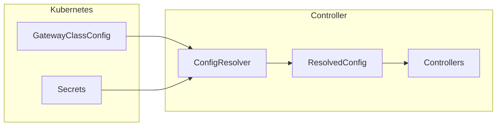

# GatewayClassConfig

GatewayClassConfig is a cluster-scoped Custom Resource Definition (CRD) that provides tunnel configuration for the controller.

## Overview

The GatewayClassConfig is referenced by a GatewayClass via `spec.parametersRef` and carries the contract the controller needs for Cloudflare API calls:

- Cloudflare API credentials
- Tunnel ID
- Optional account ID override

!!! note "v3 scope change"
    Starting v3 the proxy-side configuration (tunnel token, replicas, liveness probes) lives in the Helm chart `proxy.*` values, not in the CRD. The in-process L7 proxy is the only data plane and is deployed by the chart. The AmneziaWG sidecar that v2 attached to the controller-managed cloudflared deployment is **not** available in v3 — see [Upgrading v2 → v3](../upgrading/v2-to-v3.md) for the migration path.

## API Reference

```yaml
apiVersion: cf.k8s.lex.la/v1alpha1
kind: GatewayClassConfig
metadata:
  name: cloudflare-tunnel-config
spec:
  # Required: Cloudflare Tunnel UUID
  tunnelID: "550e8400-e29b-41d4-a716-446655440000"

  # Optional: Cloudflare Account ID (32-character lowercase hex; auto-detected if not specified)
  accountId: "0123456789abcdef0123456789abcdef"

  # Required: Reference to Secret containing API token
  cloudflareCredentialsSecretRef:
    name: cloudflare-credentials
    # key: api-token  # Default: "api-token"
```

## Field Reference

### `spec.tunnelID` (required)

The UUID of the Cloudflare Tunnel. You can find this in the Cloudflare Zero Trust dashboard under Networks > Tunnels.

```yaml
spec:
  tunnelID: "550e8400-e29b-41d4-a716-446655440000"
```

### `spec.accountId` (optional)

The Cloudflare account ID. Must be a 32-character lowercase hexadecimal string (the format Cloudflare uses for account IDs); a value that does not match this pattern is rejected at admission time by a CRD-level CEL rule. If not specified, it is read from the `account-id` key in the credentials Secret; if that key is also absent, it is auto-detected from the Cloudflare API when the token has access to a single account. Tokens with access to multiple accounts must set this field (or the `account-id` Secret key) explicitly.

```yaml
spec:
  accountId: "0123456789abcdef0123456789abcdef"
```

### `spec.cloudflareCredentialsSecretRef` (required)

Reference to a Kubernetes Secret containing the Cloudflare API token.

```yaml
spec:
  cloudflareCredentialsSecretRef:
    name: cloudflare-credentials
    # namespace: cloudflare-tunnel-system  # Optional, defaults to the controller namespace
    key: api-token  # Optional, defaults to "api-token"
```

The reference accepts three fields: `name` (required), `namespace` (optional), and `key` (optional). The referenced Secret defaults to the controller's own namespace. To place the Secret in a different namespace, set `cloudflareCredentialsSecretRef.namespace` explicitly:

```yaml
apiVersion: v1
kind: Secret
metadata:
  name: cloudflare-credentials
  namespace: cloudflare-tunnel-system
type: Opaque
stringData:
  api-token: "YOUR_API_TOKEN"
```

## Proxy configuration

The L7 proxy that terminates the tunnel and applies HTTPRoute filters is configured via Helm chart values, not via the CRD. The minimum required value is:

```yaml
proxy:
  tunnelTokenSecretRef:
    name: cloudflare-tunnel-token
    # key: tunnel-token  # Default
```

Additional knobs (replicas, image, resources, health probes, access log, websocket timeouts, auth token) are documented in the [Helm values reference](helm-values.md).

## GatewayClass Reference

The GatewayClass references the GatewayClassConfig via `parametersRef`:

```yaml
apiVersion: gateway.networking.k8s.io/v1
kind: GatewayClass
metadata:
  name: cloudflare-tunnel
spec:
  controllerName: cf.k8s.lex.la/tunnel-controller
  parametersRef:
    group: cf.k8s.lex.la
    kind: GatewayClassConfig
    name: cloudflare-tunnel-config
```

## Complete Example

```yaml
---
apiVersion: v1
kind: Secret
metadata:
  name: cloudflare-credentials
  namespace: cloudflare-tunnel-system
type: Opaque
stringData:
  api-token: "YOUR_API_TOKEN"
---
apiVersion: v1
kind: Secret
metadata:
  name: cloudflare-tunnel-token
  namespace: cloudflare-tunnel-system
type: Opaque
stringData:
  tunnel-token: "YOUR_TUNNEL_TOKEN"
---
apiVersion: cf.k8s.lex.la/v1alpha1
kind: GatewayClassConfig
metadata:
  name: cloudflare-tunnel-config
spec:
  tunnelID: "550e8400-e29b-41d4-a716-446655440000"
  cloudflareCredentialsSecretRef:
    name: cloudflare-credentials
---
apiVersion: gateway.networking.k8s.io/v1
kind: GatewayClass
metadata:
  name: cloudflare-tunnel
spec:
  controllerName: cf.k8s.lex.la/tunnel-controller
  parametersRef:
    group: cf.k8s.lex.la
    kind: GatewayClassConfig
    name: cloudflare-tunnel-config
---
apiVersion: gateway.networking.k8s.io/v1
kind: Gateway
metadata:
  name: cloudflare-tunnel
  namespace: cloudflare-tunnel-system
spec:
  gatewayClassName: cloudflare-tunnel
  listeners:
    - name: http
      protocol: HTTP
      port: 80
```

## Configuration Resolution

The controller resolves configuration in the following order:


```mermaid
flowchart LR
    subgraph Kubernetes
        GCC[GatewayClassConfig]
        SEC[Secrets]
    end

    subgraph Controller
        RES[ConfigResolver]
        CONFIG[ResolvedConfig]
        CTRL[Controllers]
    end

    GCC --> RES
    SEC --> RES
    RES --> CONFIG
    CONFIG --> CTRL
```

1. GatewayClass references GatewayClassConfig via `parametersRef`
2. Controller reads GatewayClassConfig
3. Controller fetches the referenced credentials Secret
4. Controller resolves the account ID: `spec.accountId` first, then the `account-id` key in the credentials Secret, then auto-detection via the Cloudflare API
5. Resolved configuration is used by controllers

## Troubleshooting

### Config Not Found

If the controller cannot find the GatewayClassConfig:

```bash
kubectl get gatewayclassconfig cloudflare-tunnel-config
```

Check that the name matches the `parametersRef.name` in GatewayClass.

### Secret Not Found

If the controller cannot find the referenced Secret:

```bash
kubectl get secret cloudflare-credentials --namespace cloudflare-tunnel-system
```

Ensure the Secret exists in the controller's namespace, or set `cloudflareCredentialsSecretRef.namespace` to the namespace where it actually lives.

### Account ID Detection Failed

If auto-detection fails, specify `accountId` explicitly:

```yaml
spec:
  accountId: "YOUR_ACCOUNT_ID"
```

You can find your account ID in the Cloudflare dashboard URL or via API.
