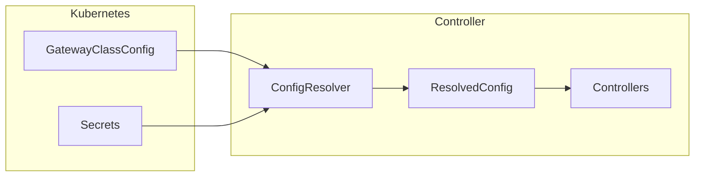

# GatewayClassConfig

GatewayClassConfig is a cluster-scoped Custom Resource Definition (CRD) that provides tunnel configuration for the controller.

## Overview

The GatewayClassConfig is referenced by a GatewayClass via `spec.parametersRef` and carries the contract the controller needs for Cloudflare API calls:

- Cloudflare API credentials
- Tunnel ID
- Optional account ID override

!!! note "Proxy settings live in the chart"
    The proxy-side configuration (tunnel token, replicas, liveness probes) lives in the Helm chart `proxy.*` values, not in the CRD. The in-process L7 proxy is the only data plane. There is no AmneziaWG sidecar; an install coming from v2, which attached one to a controller-managed cloudflared deployment, follows [Upgrading v2 → v3](../upgrading/v2-to-v3.md).

## API Reference

```yaml
apiVersion: cf.k8s.lex.la/v1alpha1
kind: GatewayClassConfig
metadata:
  name: cloudflare-tunnel-config
spec:
  # Required: Cloudflare Tunnel UUID
  tunnelID: "550e8400-e29b-41d4-a716-446655440000"

  # Optional: Cloudflare Account ID (32-character lowercase hex; auto-detected if not specified)
  accountId: "0123456789abcdef0123456789abcdef"

  # Required: Reference to Secret containing API token
  cloudflareCredentialsSecretRef:
    name: cloudflare-credentials
    # key: api-token  # Default: "api-token"
```

## Field Reference

### `spec.tunnelID` (required)

The UUID of the Cloudflare Tunnel. You can find this in the Cloudflare Zero Trust dashboard under Networks > Tunnels.

```yaml
spec:
  tunnelID: "550e8400-e29b-41d4-a716-446655440000"
```

### `spec.accountId` (optional)

The Cloudflare account ID. Must be a 32-character lowercase hexadecimal string (the format Cloudflare uses for account IDs); a value that does not match this pattern is rejected at admission time by a CRD-level CEL rule. If not specified, it is read from the `account-id` key in the credentials Secret; if that key is also absent, it is auto-detected from the Cloudflare API when the token has access to a single account. Tokens with access to multiple accounts must set this field (or the `account-id` Secret key) explicitly.

```yaml
spec:
  accountId: "0123456789abcdef0123456789abcdef"
```

### `spec.allowSharedTunnels` (optional)

Permits a Gateway with a dedicated data plane to serve a Cloudflare Tunnel that another namespace's Gateway — or this GatewayClass itself — already serves. Defaults to `false`.

A connector token that Cloudflare confirms proves access to its tunnel, not a right to the routes another namespace serves on it, and one tunnel's token can end up in two namespaces — handed to both, or copied. Sharing a tunnel merges both parties' routes and pushes the union to both parties' proxies. With this off, a Gateway claiming a tunnel another namespace already serves is refused (`Accepted=False`, reason `InvalidParameters`), none of its routes are programmed, and its data plane is not rendered at all — see the [Per-Gateway Isolation guide](../guides/per-gateway-isolation.md).

The flag waives only that contest: a claim Cloudflare does not confirm is refused either way. Turn it on only where every party on a shared tunnel is trusted to see the others' routes: a single-tenant cluster, or a migration from the shared plane to dedicated ones. The field lives on the cluster-scoped GatewayClassConfig, not on the namespaced `GatewayConfig`, so a tenant cannot grant it to themselves.

```yaml
spec:
  allowSharedTunnels: true
```

### `spec.maxDataPlanesPerNamespace` (optional)

Caps how many Gateways in one namespace may each have a dedicated data plane. Leave it unset for no cap. `0` is rejected rather than accepted as another spelling of unlimited: it is what an operator writes for "no dedicated planes at all", and a field that granted the opposite would fail open.

Every Gateway that opts in through `spec.infrastructure.parametersRef` renders a proxy Deployment, a headless Service, a NetworkPolicy and an optional HPA into its own namespace, and registers a connector on its tunnel. Without a cap, a tenant who can create Gateways and `GatewayConfig` objects decides how much of the cluster to consume.

Past the cap the newest Gateways are refused (`Accepted=False`, reason `DataPlaneQuotaExceeded`), no plane is rendered for them, and their routes are programmed nowhere. Ordering is by creation timestamp, so a Gateway created now takes a free slot or is refused and never evicts one already serving. Two things do evict: lowering the cap, and an OLDER Gateway opting in later — see the [Per-Gateway Isolation guide](../guides/per-gateway-isolation.md#capping-data-planes-per-namespace).

Like `allowSharedTunnels`, the field lives on the cluster-scoped GatewayClassConfig so a tenant cannot raise their own cap.

```yaml
spec:
  maxDataPlanesPerNamespace: 5
```

### `spec.cloudflareCredentialsSecretRef` (required)

Reference to a Kubernetes Secret containing the Cloudflare API token.

```yaml
spec:
  cloudflareCredentialsSecretRef:
    name: cloudflare-credentials
    # namespace: cloudflare-tunnel-system  # Optional, defaults to the controller namespace
    key: api-token  # Optional, defaults to "api-token"
```

The reference accepts three fields: `name` (required), `namespace` (optional), and `key` (optional). The referenced Secret defaults to the controller's own namespace. To place the Secret in a different namespace, set `cloudflareCredentialsSecretRef.namespace` explicitly:

```yaml
apiVersion: v1
kind: Secret
metadata:
  name: cloudflare-credentials
  namespace: cloudflare-tunnel-system
type: Opaque
stringData:
  api-token: "YOUR_API_TOKEN"
```

## Proxy configuration

The L7 proxy that terminates the tunnel and applies HTTPRoute filters is configured via Helm chart values, not via the CRD. The minimum required value is:

```yaml
proxy:
  tunnelTokenSecretRef:
    name: cloudflare-tunnel-token
    # key: tunnel-token  # Default
```

Additional knobs (replicas, image, resources, health probes, access log, websocket timeouts, auth token) are documented in the [Helm values reference](helm-values.md).

## GatewayClass Reference

The GatewayClass references the GatewayClassConfig via `parametersRef`:

```yaml
apiVersion: gateway.networking.k8s.io/v1
kind: GatewayClass
metadata:
  name: cloudflare-tunnel
spec:
  controllerName: cf.k8s.lex.la/tunnel-controller
  parametersRef:
    group: cf.k8s.lex.la
    kind: GatewayClassConfig
    name: cloudflare-tunnel-config
```

Leave `parametersRef.namespace` unset. GatewayClassConfig is cluster-scoped, and Gateway API requires the namespace to be unset for a cluster-scoped referent. Since v4.0.0 a GatewayClass reports `Accepted: False` with reason `InvalidParameters` when its `parametersRef` is missing, names a group or kind other than `cf.k8s.lex.la` `GatewayClassConfig`, sets `namespace`, or names a GatewayClassConfig that does not exist. The message says which. While a Gateway uses a class whose ref sets `namespace`, the controller refuses to resolve that ref and programs no routes for any of its Gateways until the field is removed. Creating the missing GatewayClassConfig re-evaluates the class. Earlier releases reported every such class as accepted.

One controller serves one GatewayClassConfig. Several GatewayClasses may name the same `controllerName`, but every one of them that a Gateway uses must carry the same `parametersRef`; a class without one conflicts with any class that has one. A class no Gateway uses is ignored while some Gateway uses another; with no Gateway on any class, route sync stays stopped until the classes agree, and the class tunnel keeps its last document until then. While the classes in use disagree, the controller programs no routes, every Gateway on those classes reports `Accepted: False` with reason `InvalidParameters` and a message naming the classes, and no new per-Gateway data plane is rendered. Data planes already running keep the configuration they last received, unless the tunnel rule or the per-namespace cap refuses them, which still removes them; such a Gateway's status reports that refusal rather than the conflict. Their Deployments are frozen too: a `GatewayConfig` edit, an image change or a token rotation reaches a running plane only once the classes agree. Gateways keep the tunnel address in their status, so DNS records published from it stay in place. Delete a GatewayClass you do not use rather than leave it pointing elsewhere. GatewayClass is cluster-scoped, so only the operator can create one, but a Gateway from any namespace that names it puts it back in use and stops route sync for every Gateway.

## Complete Example

```yaml
---
apiVersion: v1
kind: Secret
metadata:
  name: cloudflare-credentials
  namespace: cloudflare-tunnel-system
type: Opaque
stringData:
  api-token: "YOUR_API_TOKEN"
---
apiVersion: v1
kind: Secret
metadata:
  name: cloudflare-tunnel-token
  namespace: cloudflare-tunnel-system
type: Opaque
stringData:
  tunnel-token: "YOUR_TUNNEL_TOKEN"
---
apiVersion: cf.k8s.lex.la/v1alpha1
kind: GatewayClassConfig
metadata:
  name: cloudflare-tunnel-config
spec:
  tunnelID: "550e8400-e29b-41d4-a716-446655440000"
  cloudflareCredentialsSecretRef:
    name: cloudflare-credentials
---
apiVersion: gateway.networking.k8s.io/v1
kind: GatewayClass
metadata:
  name: cloudflare-tunnel
spec:
  controllerName: cf.k8s.lex.la/tunnel-controller
  parametersRef:
    group: cf.k8s.lex.la
    kind: GatewayClassConfig
    name: cloudflare-tunnel-config
---
apiVersion: gateway.networking.k8s.io/v1
kind: Gateway
metadata:
  name: cloudflare-tunnel
  namespace: cloudflare-tunnel-system
spec:
  gatewayClassName: cloudflare-tunnel
  listeners:
    - name: https
      protocol: HTTPS
      port: 443
```

## Configuration Resolution

The controller resolves configuration in the following order:


```mermaid
flowchart LR
    subgraph Kubernetes
        GCC[GatewayClassConfig]
        SEC[Secrets]
    end

    subgraph Controller
        RES[ConfigResolver]
        CONFIG[ResolvedConfig]
        CTRL[Controllers]
    end

    GCC --> RES
    SEC --> RES
    RES --> CONFIG
    CONFIG --> CTRL
```

1. GatewayClass references GatewayClassConfig via `parametersRef`
2. Controller reads GatewayClassConfig
3. Controller fetches the referenced credentials Secret
4. Controller resolves the account ID: `spec.accountId` first, then the `account-id` key in the credentials Secret, then auto-detection via the Cloudflare API
5. Resolved configuration is used by controllers

## Troubleshooting

### Config Not Found

If the controller cannot find the GatewayClassConfig:

```bash
kubectl get gatewayclassconfig cloudflare-tunnel-config
```

Check that the name matches the `parametersRef.name` in GatewayClass. The GatewayClass reports this as `Accepted: False` with reason `InvalidParameters`:

```bash
kubectl get gatewayclass cloudflare-tunnel --output jsonpath='{.status.conditions[?(@.type=="Accepted")]}'
```

### Secret Not Found

If the controller cannot find the referenced Secret:

```bash
kubectl get secret cloudflare-credentials --namespace cloudflare-tunnel-system
```

Ensure the Secret exists in the controller's namespace, or set `cloudflareCredentialsSecretRef.namespace` to the namespace where it actually lives.

### Account ID Detection Failed

If auto-detection fails, specify `accountId` explicitly:

```yaml
spec:
  accountId: "YOUR_ACCOUNT_ID"
```

You can find your account ID in the Cloudflare dashboard URL or via API.
