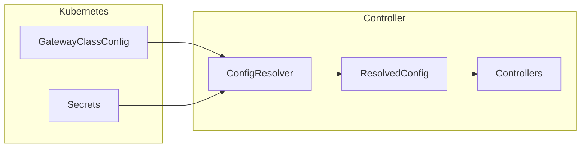

# Configuration

This section covers all configuration options for the Cloudflare Tunnel Gateway
Controller.

## Overview

The controller can be configured at multiple levels:

1. **Controller Options** - CLI flags and environment variables
2. **Helm Values** - Deployment configuration via Helm chart
3. **GatewayClassConfig** - Tunnel credentials and cloudflared settings

## Sections

-   :material-console:{ .lg .middle } **Controller Options**

    ---

    CLI flags, environment variables, and runtime configuration.

    [:octicons-arrow-right-24: Controller Options](controller.md)

-   :material-kubernetes:{ .lg .middle } **Helm Values**

    ---

    Complete reference for Helm chart configuration values.

    [:octicons-arrow-right-24: Helm Values](helm-values.md)

-   :material-cog:{ .lg .middle } **GatewayClassConfig**

    ---

    Custom Resource for tunnel credentials and cloudflared configuration.

    [:octicons-arrow-right-24: GatewayClassConfig](gatewayclassconfig.md)

## Configuration Flow

## Quick Reference

| Configuration | Source | Purpose |
|---------------|--------|---------|
| `--controller-name` | CLI flag | GatewayClass controller name |
| `--manage-cloudflared` | CLI flag | Enable cloudflared deployment |
| `tunnelID` | GatewayClassConfig | Cloudflare Tunnel UUID |
| `cloudflareCredentialsSecretRef` | GatewayClassConfig | API token secret reference |
| `tunnelTokenSecretRef` | GatewayClassConfig | Tunnel token for cloudflared |
