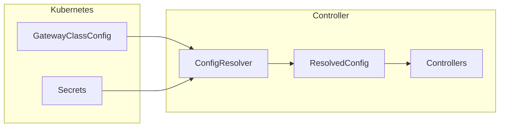

# Configuration

This section covers all configuration options for the Cloudflare Tunnel Gateway Controller.

## Overview

The controller can be configured at multiple levels:

1. **Controller Options** - CLI flags and environment variables
2. **Helm Values** - Deployment configuration via Helm chart
3. **GatewayClassConfig** - Tunnel credentials and cloudflared settings

## Sections

-   :material-console:{ .lg .middle } **Controller Options**

    ---

    CLI flags, environment variables, and runtime configuration.

    [:octicons-arrow-right-24: Controller Options](controller.md)

-   :material-kubernetes:{ .lg .middle } **Helm Values**

    ---

    Complete reference for Helm chart configuration values.

    [:octicons-arrow-right-24: Helm Values](helm-values.md)

-   :material-cog:{ .lg .middle } **GatewayClassConfig**

    ---

    Custom Resource for tunnel credentials and cloudflared configuration.

    [:octicons-arrow-right-24: GatewayClassConfig](gatewayclassconfig.md)

-   :material-server-network:{ .lg .middle } **L7 Proxy Configuration**

    ---

    Helm values for the L7 reverse proxy: replicas, resources, health probes, networking, and security contexts.

    [:octicons-arrow-right-24: L7 Proxy Values](helm-values.md#l7-proxy-configuration)

## Configuration Flow

```mermaid
flowchart LR
    subgraph Kubernetes
        GCC[GatewayClassConfig]
        SEC[Secrets]
    end

    subgraph Controller
        RES[ConfigResolver]
        CONFIG[ResolvedConfig]
        CTRL[Controllers]
    end

    GCC --> RES
    SEC --> RES
    RES --> CONFIG
    CONFIG --> CTRL
```

## Quick Reference

| Configuration | Source | Purpose |
|---------------|--------|---------|
| `--controller-name` | CLI flag | GatewayClass `spec.controllerName` this instance binds to |
| `--proxy-endpoints` | CLI flag | Proxy config-API URLs (required; the chart wires this to the proxy headless Service) |
| `tunnelID` | GatewayClassConfig | Cloudflare Tunnel UUID |
| `accountId` | GatewayClassConfig | Optional account ID override (auto-detected otherwise) |
| `cloudflareCredentialsSecretRef` | GatewayClassConfig | API token Secret reference |
| `proxy.tunnelTokenSecretRef` | Helm values | Tunnel token Secret reference (consumed by the proxy pod) |
