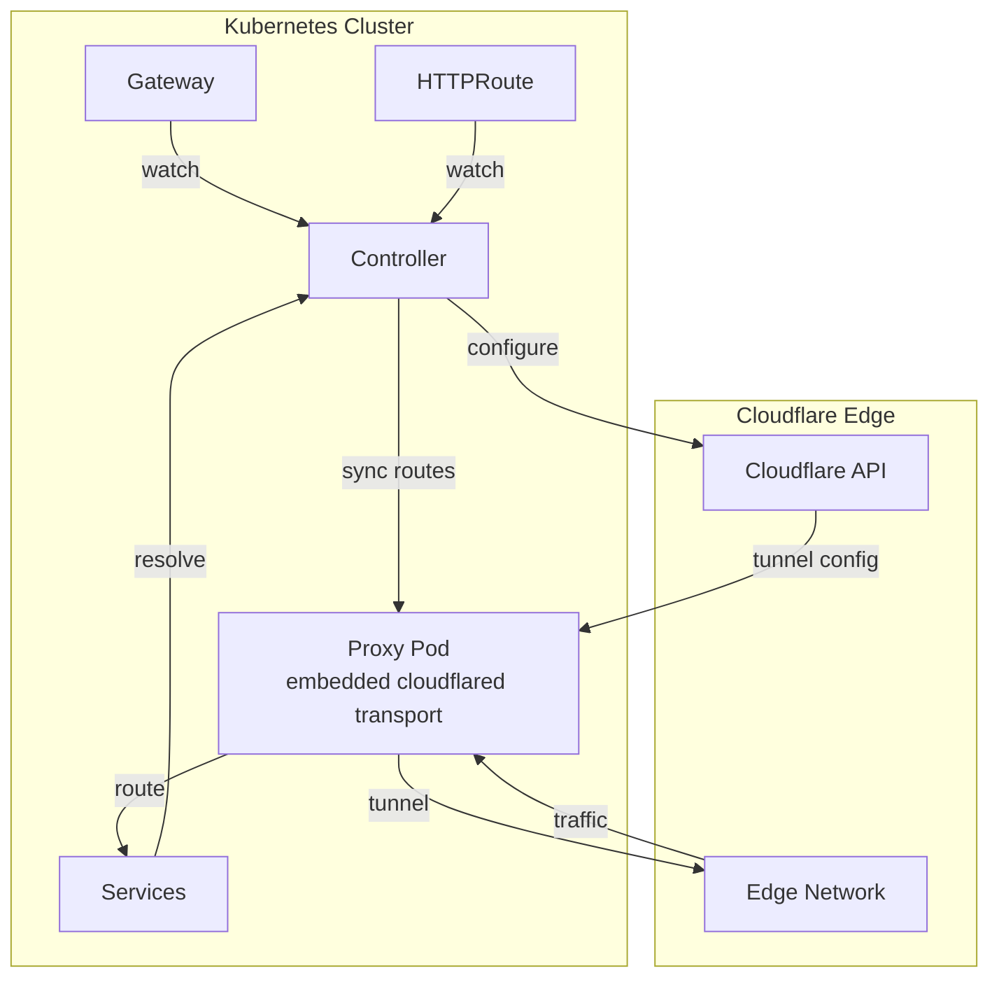
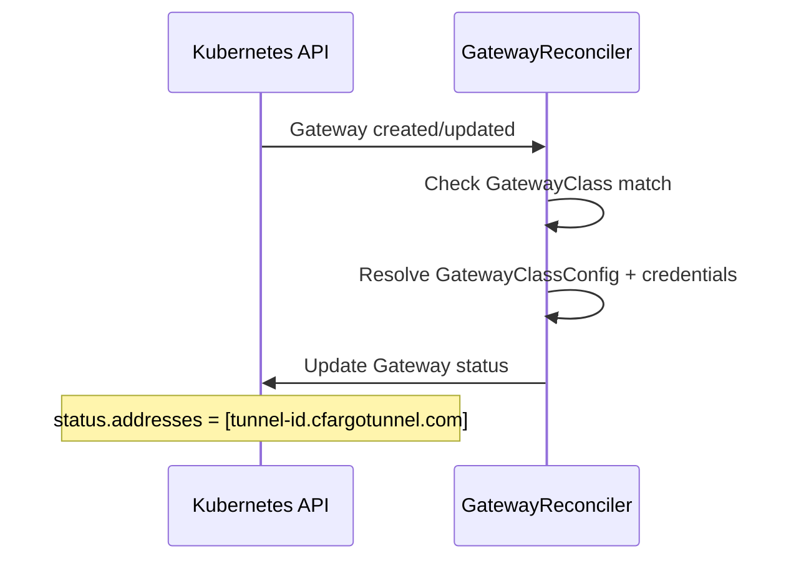
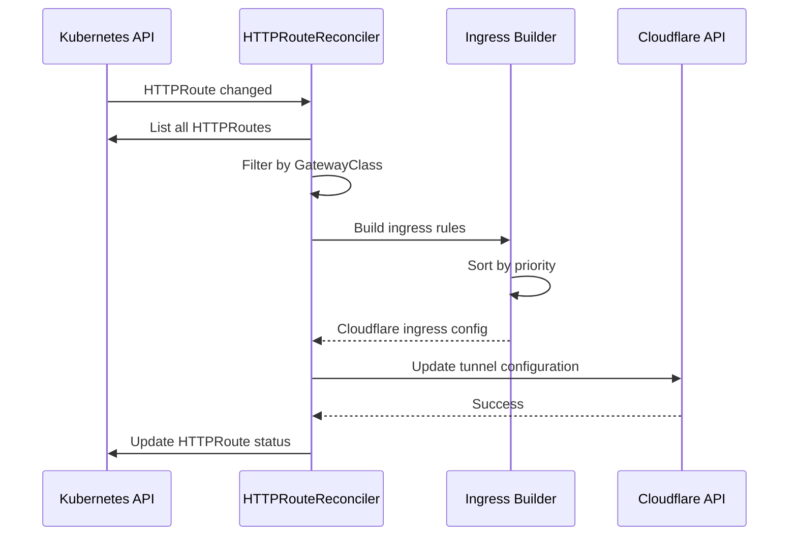
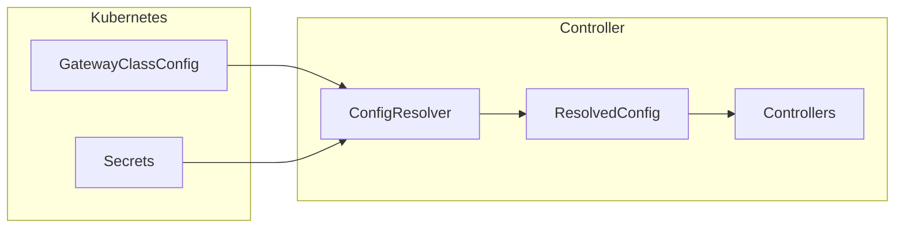
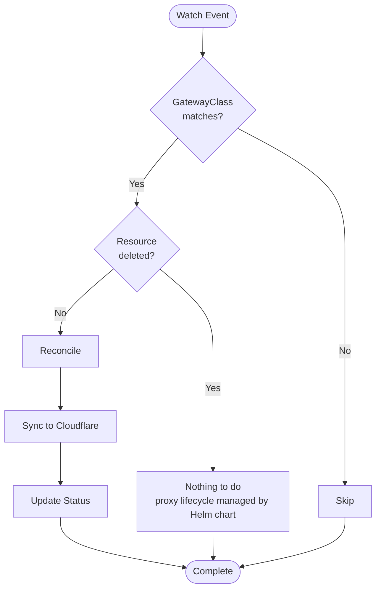
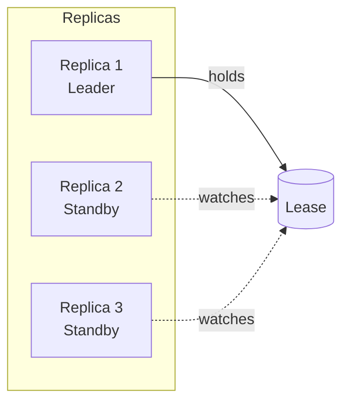
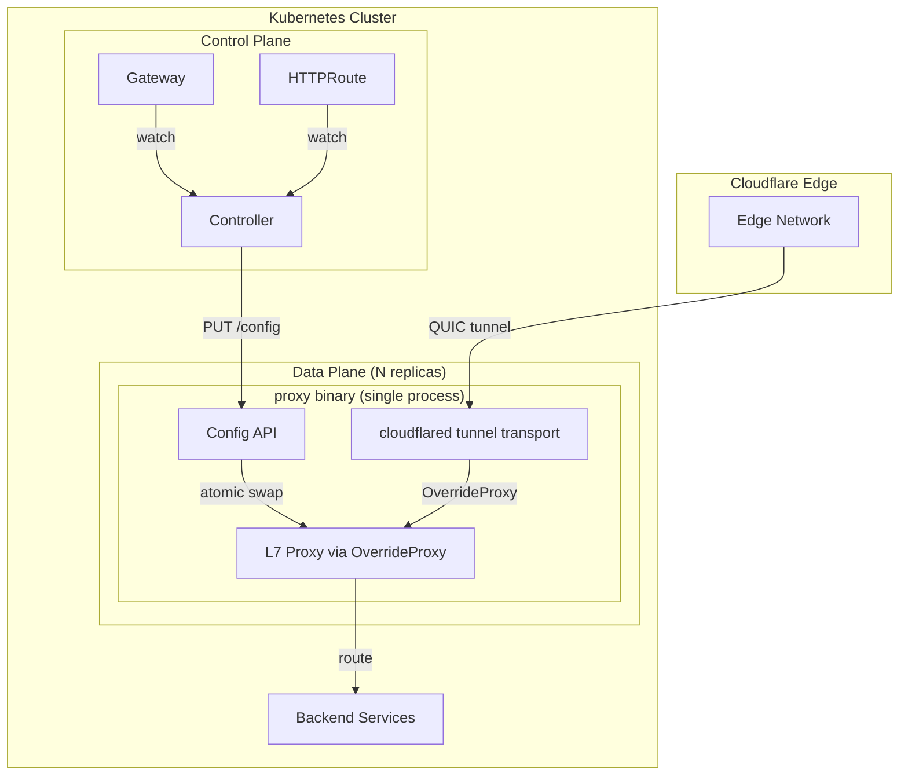

# Architecture

This document describes the internal architecture of the Cloudflare Tunnel Gateway Controller and its in-process L7 proxy data plane.

## High-Level Overview

The controller implements the Kubernetes Gateway API to configure Cloudflare Tunnel ingress rules. It watches Gateway and HTTPRoute resources, translates them into Cloudflare Tunnel configuration via the Cloudflare API, and pushes route state to the in-process L7 proxy that carries tunnel traffic.


```mermaid
flowchart TB
    subgraph Kubernetes["Kubernetes Cluster"]
        GW[Gateway]
        HR[HTTPRoute]
        SVC[Services]
        CTRL[Controller]
        PROXY[Proxy Pod<br/>embedded cloudflared transport]
    end

    subgraph Cloudflare["Cloudflare Edge"]
        API[Cloudflare API]
        EDGE[Edge Network]
    end

    GW -->|watch| CTRL
    HR -->|watch| CTRL
    SVC -->|resolve| CTRL
    CTRL -->|configure| API
    CTRL -->|sync routes| PROXY
    API -->|tunnel config| PROXY
    PROXY -->|tunnel| EDGE
    EDGE -->|traffic| PROXY
    PROXY -->|route| SVC
```

## Package Structure

```text
api/v1alpha1/            # GatewayClassConfig CRD types

cmd/controller/
├── main.go              # Entry point, version injection
└── cmd/
    └── root.go          # CLI flags, Cobra command

internal/
├── config/
│   └── resolver.go      # GatewayClassConfig resolution from Secrets
├── controller/
│   ├── manager.go       # Controller manager setup, Run()
│   ├── gateway_controller.go        # Gateway reconciler
│   ├── gatewayclass_controller.go   # GatewayClass reconciler
│   ├── gatewayclassconfig_controller.go  # GatewayClassConfig reconciler
│   ├── httproute_controller.go      # HTTPRoute reconciler
│   ├── grpcroute_controller.go      # GRPCRoute reconciler
│   └── proxy_syncer.go             # Config push to proxy replicas
├── dns/
│   └── detect.go        # Cluster domain auto-detection
├── ingress/
│   └── builder.go       # HTTPRoute → Cloudflare rules conversion
├── referencegrant/      # ReferenceGrant validation for cross-namespace backends
├── routebinding/        # Route-to-Gateway binding validation
├── proxy/               # L7 reverse proxy (see Proxy Architecture doc)
├── tunnel/              # cloudflared tunnel bootstrap and OriginProxy adapter
├── logging/             # Structured logging helpers
└── cfmetrics/           # Cloudflare metrics collection
```

## Components

### GatewayClassConfig

Cluster-scoped Custom Resource Definition (CRD) that provides tunnel configuration:

- **API Group**: `cf.k8s.lex.la/v1alpha1`
- **Referenced by**: GatewayClass via `spec.parametersRef`
- **Spec fields (v3)**: `cloudflareCredentialsSecretRef`, optional `accountId`, `tunnelID`. Proxy-side configuration (tunnel token, replicas, etc.) lives in Helm chart `proxy.*` values.

```yaml
apiVersion: cf.k8s.lex.la/v1alpha1
kind: GatewayClassConfig
metadata:
  name: cloudflare-tunnel-config
spec:
  tunnelID: "550e8400-e29b-41d4-a716-446655440000"
  cloudflareCredentialsSecretRef:
    name: cloudflare-credentials
  # accountId: "1234567890abcdef"  # Optional, auto-detected
```

### ConfigResolver

Resolves GatewayClassConfig from GatewayClass `parametersRef`:

1. Reads GatewayClassConfig by name from parametersRef
2. Fetches Cloudflare credentials from referenced Secret
3. Auto-detects account ID via Cloudflare API if not specified

### GatewayReconciler

Watches Gateway resources and performs the following:

1. **Filtering**: Only processes Gateways whose GatewayClass has a matching `spec.controllerName`
2. **Status Update**: Sets Gateway address to `<tunnel-id>.cfargotunnel.com` so external-dns / DNS controllers can pick up the CNAME target

Starting v3 the reconciler is status-only — the proxy data plane is deployed by the Helm chart, not by the controller, so there is no finalizer and no controller-side cloudflared lifecycle to wait on.


```mermaid
sequenceDiagram
    participant K8s as Kubernetes API
    participant GR as GatewayReconciler

    K8s->>GR: Gateway created/updated
    GR->>GR: Check GatewayClass match
    GR->>GR: Resolve GatewayClassConfig + credentials
    GR->>K8s: Update Gateway status
    Note over K8s: status.addresses = [tunnel-id.cfargotunnel.com]
```

### HTTPRouteReconciler

Watches HTTPRoute resources and synchronizes them to Cloudflare:

1. **Filtering**: Only processes routes referencing managed Gateways
2. **Full Sync**: On any change, rebuilds entire tunnel configuration
3. **API Update**: Pushes configuration to Cloudflare API
4. **Status Update**: Sets route acceptance conditions


```mermaid
sequenceDiagram
    participant K8s as Kubernetes API
    participant HR as HTTPRouteReconciler
    participant Builder as Ingress Builder
    participant CF as Cloudflare API

    K8s->>HR: HTTPRoute changed
    HR->>K8s: List all HTTPRoutes
    HR->>HR: Filter by GatewayClass
    HR->>Builder: Build ingress rules
    Builder->>Builder: Sort by priority
    Builder-->>HR: Cloudflare ingress config
    HR->>CF: Update tunnel configuration
    CF-->>HR: Success
    HR->>K8s: Update HTTPRoute status
```

### Ingress Builder

Converts HTTPRoute specs to Cloudflare Tunnel ingress rules:

| HTTPRoute Field | Cloudflare Rule Field |
|-----------------|----------------------|
| `spec.hostnames[]` | `hostname` |
| `rules[].matches[].path` | `path` (with wildcard for prefix) |
| `rules[].backendRefs[]` | `service` (cluster DNS URL) |

**Rule Ordering**:

1. Specific hostnames before the wildcard `*` (Cloudflare requirement), then alphabetically among specific hostnames
2. Exact matches before prefix matches
3. Longer paths before shorter paths

### ProxySyncer

Pushes routing config to the L7 proxy pods over HTTP:

- **Endpoint discovery**: Resolves the proxy's headless Service DNS name to per-pod URLs (`--proxy-endpoints` is a required CLI flag — `internal/controller/manager.go` rejects an empty value at startup).
- **Conversion**: Translates HTTPRoute specs into the proxy's wire-format config via `internal/proxy/converter.go`.
- **Auth**: When `proxy.authTokenSecretRef.name` is set, attaches the Bearer token to every push so unauthenticated clients cannot reprogram the proxy.
- **Last-config cache**: After every successful `SyncRoutes` push, ProxySyncer caches the built `*proxy.Config` under its mutex. `ResyncEndpoints(endpoints)` replays that cached config to a supplied endpoint list without rebuilding from HTTPRoutes — the bootstrap-race fix below depends on this.

### Config push triggers

Config push fires on TWO independent events:

1. **HTTPRoute reconcile** — the canonical path. Any change to an HTTPRoute (create, update, delete, status flip) reconciles the route set, rebuilds the proxy config, caches it, and pushes to every endpoint currently visible to the headless-Service DNS lookup.
2. **Proxy EndpointSlice change** — the bootstrap-race fix from issue #293. `ProxyEndpointReconciler` (`internal/controller/proxy_endpoint_reconciler.go`) watches EndpointSlices labelled `kubernetes.io/service-name=<headless-svc>` for each Service named in `--proxy-endpoints`. On any change it calls `ProxySyncer.ResyncEndpoints` with the static `--proxy-endpoints` URL list, which re-resolves DNS and pushes the cached config to every replica it finds — including the newly-joined ones.

Without the second trigger a proxy pod that becomes Ready between HTTPRoute reconciles stays at `/readyz == 503` forever: the first HTTPRoute reconcile published config to the pods that existed at the time, and there is no next HTTPRoute change to fan out to the new pod. The historic workaround was `kubectl rollout restart deployment <controller>`; the watcher removes that requirement.

GRPCRoutes are pushed to the proxy alongside HTTPRoutes: `internal/proxy/grpc_converter.go` maps gRPC service/method matches onto `/{service}/{method}` path rules and dials h2c upstream by default (a `BackendTLSPolicy` puts TLS on the wire instead, and a TLS Service `appProtocol` with no policy fails the backend closed, mirroring the HTTPRoute path), and `ProxySyncer.SyncRoutes` merges them into the pushed config. The Cloudflare-side ingress rules built by `internal/ingress/grpc_builder` populate the dashboard's hostname → service view but are not consulted at runtime (the `OverrideProxy` hook intercepts all tunnel traffic). See [GRPCRoute](../gateway-api/grpcroute.md).

## Data Flow

### Configuration Flow


```mermaid
flowchart LR
    subgraph Kubernetes
        GCC[GatewayClassConfig]
        SEC[Secrets]
    end

    subgraph Controller
        RES[ConfigResolver]
        CONFIG[ResolvedConfig]
        CTRL[Controllers]
    end

    GCC --> RES
    SEC --> RES
    RES --> CONFIG
    CONFIG --> CTRL
```

### Reconciliation Flow


```mermaid
flowchart TB
    START([Watch Event]) --> CHECK{GatewayClass<br/>matches?}
    CHECK -->|No| SKIP[Skip]
    CHECK -->|Yes| DELETED{Resource<br/>deleted?}

    DELETED -->|Yes| GONE[Nothing to do<br/>proxy lifecycle managed by Helm chart]
    DELETED -->|No| RECONCILE[Reconcile]

    RECONCILE --> SYNC[Sync to Cloudflare]
    SYNC --> STATUS[Update Status]

    STATUS --> END([Complete])
    GONE --> END
    SKIP --> END
```

## Error Handling

The controller follows these error handling patterns:

1. **Retryable Errors**: Return `ctrl.Result{Requeue: true}` for transient failures
2. **Permanent Errors**: Log error and update resource status condition
3. **API Errors**: Wrapped with context using `cockroachdb/errors`
4. **Not Found**: Silently ignore (resource was deleted)

## Leader Election

When running multiple replicas for high availability:

- Only one replica is the active leader
- Leader acquires lease in `coordination.k8s.io/leases`
- Other replicas wait in standby mode
- Automatic failover on leader failure


```mermaid
flowchart LR
    subgraph Replicas
        R1[Replica 1<br/>Leader]
        R2[Replica 2<br/>Standby]
        R3[Replica 3<br/>Standby]
    end

    LEASE[(Lease)]

    R1 -->|holds| LEASE
    R2 -.->|watches| LEASE
    R3 -.->|watches| LEASE
```

## Security Considerations

| Aspect | Implementation |
|--------|----------------|
| **API Token** | Stored in Kubernetes Secret, mounted as environment variable |
| **RBAC** | Minimal permissions following least-privilege principle |
| **Network** | Controller only needs egress to Cloudflare API |
| **Container** | Runs as non-root user (UID 65534) with read-only filesystem |

## L7 Proxy Data Plane

An in-process L7 proxy is embedded inside cloudflared via the `OverrideProxy` hook (using a [fork of cloudflared](https://github.com/lexfrei/cloudflared)). All tunnel traffic is intercepted by the proxy, which applies Gateway API routing rules before forwarding to backends. This removes most Cloudflare Tunnel ingress API limitations.


```mermaid
flowchart TB
    subgraph Kubernetes["Kubernetes Cluster"]
        subgraph ControlPlane["Control Plane"]
            CTRL[Controller]
            GW[Gateway]
            HR[HTTPRoute]
        end

        subgraph DataPlane["Data Plane (N replicas)"]
            subgraph ProxyProcess["proxy binary (single process)"]
                CFD[cloudflared tunnel transport]
                L7[L7 Proxy via OverrideProxy]
                CAPI[Config API]
            end
        end

        SVC[Backend Services]
    end

    subgraph Cloudflare["Cloudflare Edge"]
        EDGE[Edge Network]
    end

    GW -->|watch| CTRL
    HR -->|watch| CTRL
    CTRL -->|PUT /config| CAPI
    CAPI -->|atomic swap| L7
    EDGE -->|QUIC tunnel| CFD
    CFD -->|OverrideProxy| L7
    L7 -->|route| SVC
```

### L7 Proxy Package Structure

```text
cmd/proxy/              # Proxy binary entry point
internal/
├── proxy/              # L7 reverse proxy core
│   ├── config.go       # Config types and validation
│   ├── matcher.go      # Path/header/query/method matchers
│   ├── router.go       # Routing table with atomic config swap
│   ├── filter.go       # Request/response filters
│   ├── handler.go      # HTTP handler pipeline
│   ├── api.go          # Config API server
│   ├── converter.go    # Gateway API HTTPRoute → proxy config conversion
│   └── pusher.go       # HTTP client for pushing config to proxy replicas
├── tunnel/             # cloudflared integration
│   ├── origin.go       # OriginProxy implementation
│   └── bootstrap.go    # Tunnel startup from token
└── controller/
    └── proxy_syncer.go # Config push to proxy replicas
```

For detailed proxy internals, see [Proxy Architecture](proxy-architecture.md).

## Key Dependencies

- `sigs.k8s.io/controller-runtime` - Kubernetes controller framework
- `sigs.k8s.io/gateway-api` - Gateway API types
- `github.com/cloudflare/cloudflare-go/v7` - Cloudflare API client
- `github.com/lexfrei/cloudflared` - Cloudflare tunnel daemon (fork with OverrideProxy)
- `github.com/cockroachdb/errors` - Error wrapping
