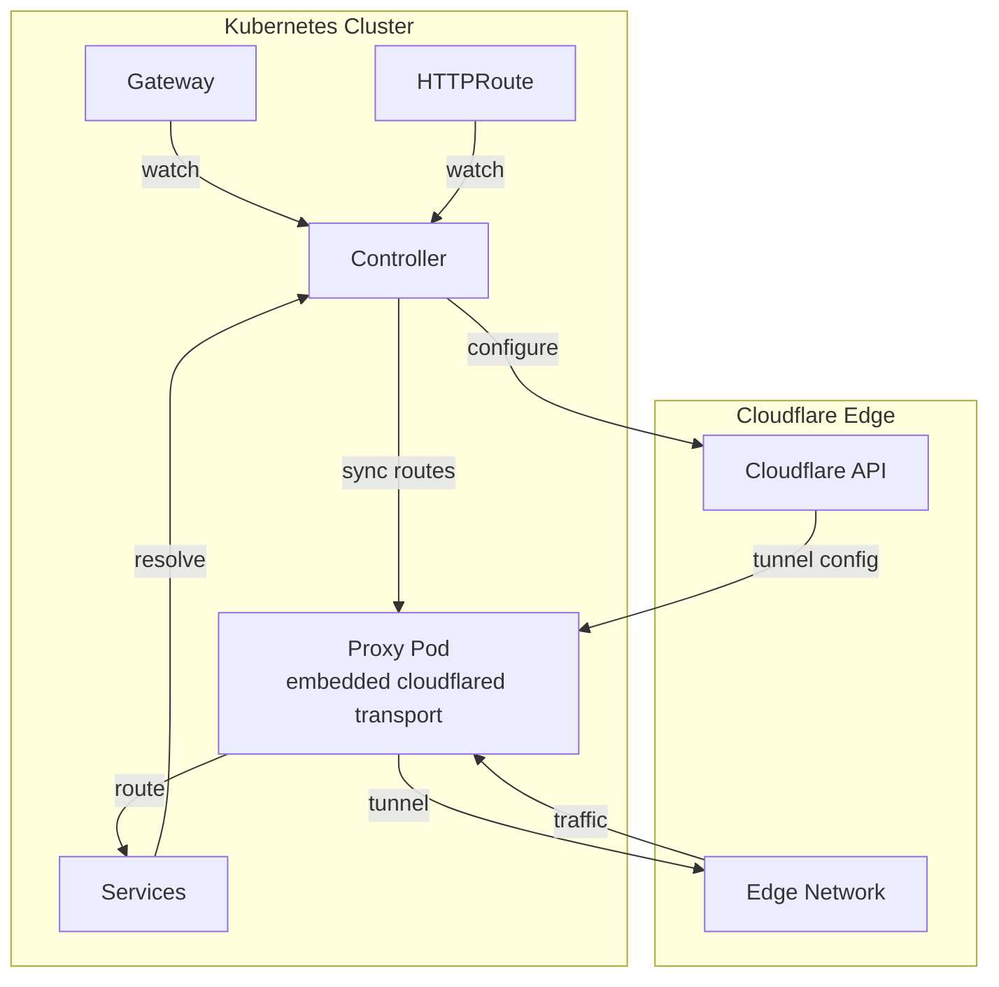
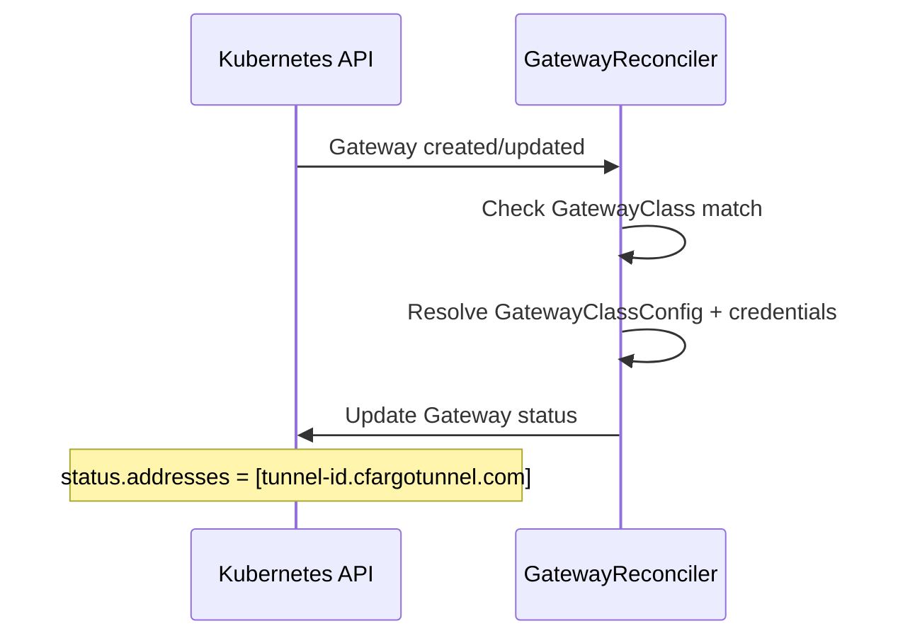
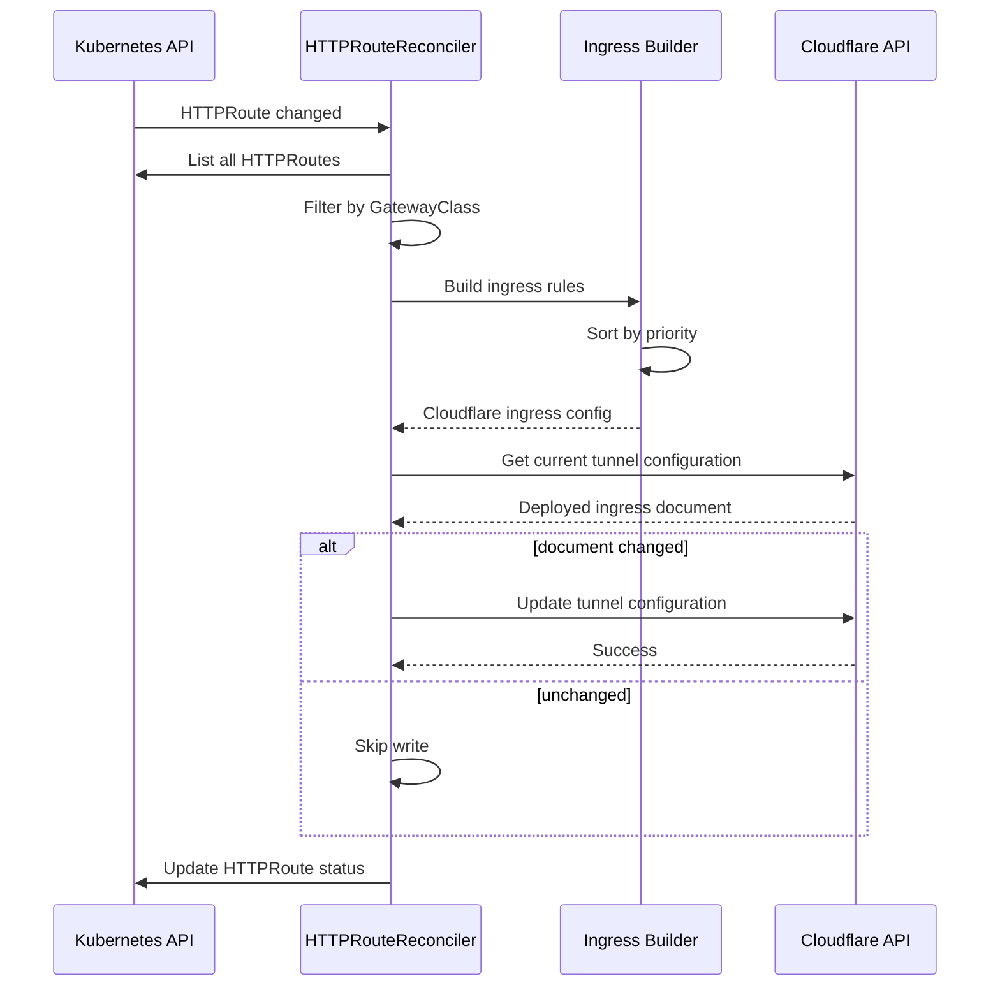
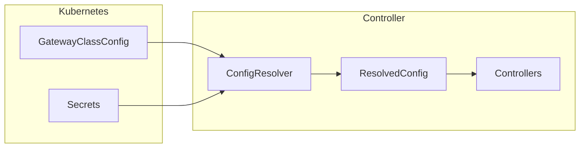
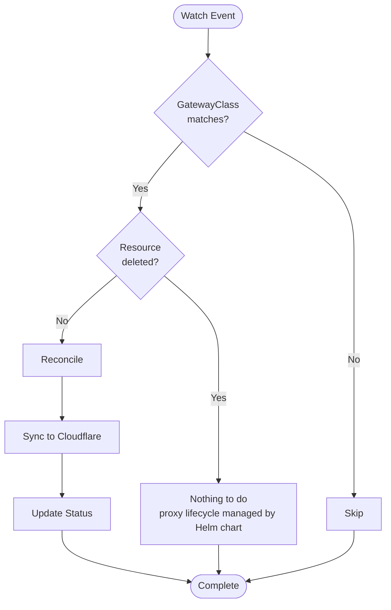
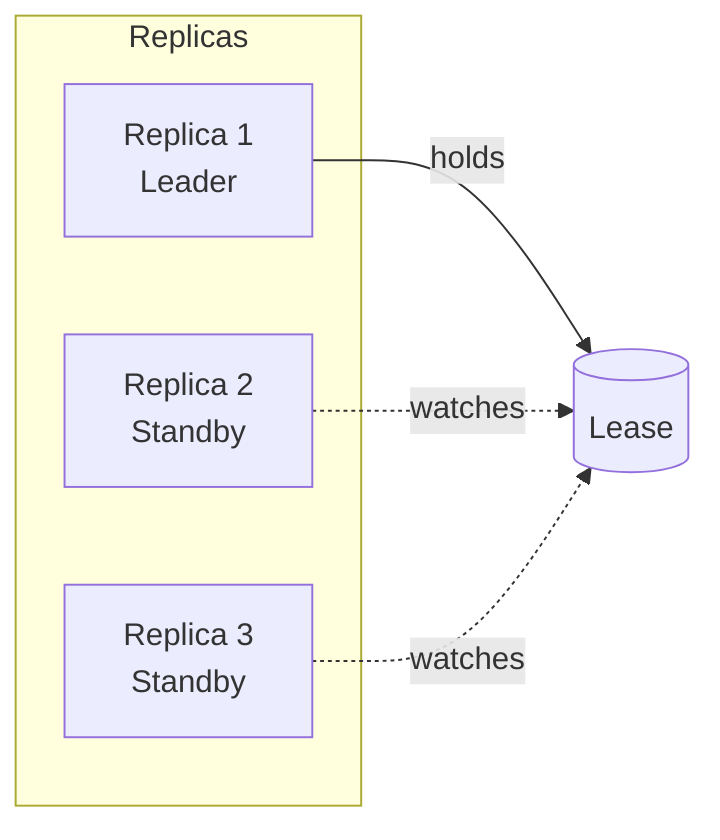
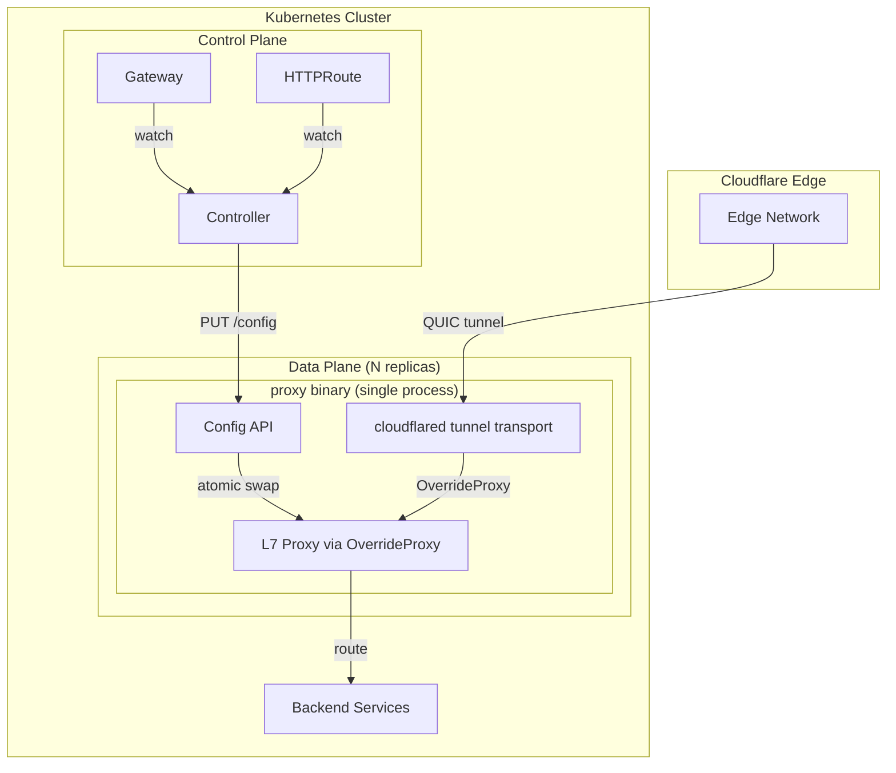

# Architecture

This document describes the internal architecture of the Cloudflare Tunnel Gateway Controller and its in-process L7 proxy data plane.

## High-Level Overview

The controller implements the Kubernetes Gateway API to configure Cloudflare Tunnel ingress rules. It watches Gateway and HTTPRoute resources, translates them into Cloudflare Tunnel configuration via the Cloudflare API, and pushes route state to the in-process L7 proxy that carries tunnel traffic.


```mermaid
flowchart TB
    subgraph Kubernetes["Kubernetes Cluster"]
        GW[Gateway]
        HR[HTTPRoute]
        SVC[Services]
        CTRL[Controller]
        PROXY[Proxy Pod<br/>embedded cloudflared transport]
    end

    subgraph Cloudflare["Cloudflare Edge"]
        API[Cloudflare API]
        EDGE[Edge Network]
    end

    GW -->|watch| CTRL
    HR -->|watch| CTRL
    SVC -->|resolve| CTRL
    CTRL -->|configure| API
    CTRL -->|sync routes| PROXY
    API -->|tunnel config| PROXY
    PROXY -->|tunnel| EDGE
    EDGE -->|traffic| PROXY
    PROXY -->|route| SVC
```

## Package Structure

```text
api/v1alpha1/            # GatewayClassConfig CRD types

cmd/controller/
├── main.go              # Entry point, version injection
└── cmd/
    └── root.go          # CLI flags, Cobra command

internal/
├── config/
│   └── resolver.go      # GatewayClassConfig resolution from Secrets
├── controller/
│   ├── manager.go       # Controller manager setup, Run()
│   ├── gateway_controller.go        # Gateway reconciler
│   ├── gatewayclass_controller.go   # GatewayClass reconciler
│   ├── gatewayclassconfig_controller.go  # GatewayClassConfig reconciler
│   ├── httproute_controller.go      # HTTPRoute reconciler
│   ├── grpcroute_controller.go      # GRPCRoute reconciler
│   └── proxy_syncer.go             # Config push to proxy replicas
├── coregroup/           # Core API group predicate for backendRefs, their ReferenceGrants and BackendTLSPolicy CA refs
├── dns/
│   └── detect.go        # Cluster domain auto-detection
├── ingress/
│   └── builder.go       # HTTPRoute → Cloudflare rules conversion
├── parentref/           # Gateway API group predicate for route parentRefs
├── referencegrant/      # ReferenceGrant validation for cross-namespace backends
├── routebinding/        # Route-to-Gateway binding validation
├── proxy/               # L7 reverse proxy (see Proxy Architecture doc)
├── tunnel/              # cloudflared tunnel bootstrap and OriginProxy adapter
├── logging/             # Structured logging helpers
└── cfmetrics/           # Cloudflare metrics collection
```

## Components

### GatewayClassConfig

Cluster-scoped Custom Resource Definition (CRD) that provides tunnel configuration:

- **API Group**: `cf.k8s.lex.la/v1alpha1`
- **Referenced by**: GatewayClass via `spec.parametersRef`
- **Spec fields**: `cloudflareCredentialsSecretRef`, optional `accountId`, `tunnelID`. Proxy-side configuration (tunnel token, replicas, etc.) lives in Helm chart `proxy.*` values.

```yaml
apiVersion: cf.k8s.lex.la/v1alpha1
kind: GatewayClassConfig
metadata:
  name: cloudflare-tunnel-config
spec:
  tunnelID: "550e8400-e29b-41d4-a716-446655440000"
  cloudflareCredentialsSecretRef:
    name: cloudflare-credentials
  # accountId: "1234567890abcdef"  # Optional, auto-detected
```

### ConfigResolver

Resolves GatewayClassConfig from GatewayClass `parametersRef`:

1. Reads GatewayClassConfig by name from parametersRef
2. Fetches Cloudflare credentials from referenced Secret
3. Auto-detects account ID via Cloudflare API if not specified

### GatewayReconciler

Watches Gateway resources and performs the following:

1. **Filtering**: Only processes Gateways whose GatewayClass has a matching `spec.controllerName`
2. **Status Update**: Sets Gateway address to `<tunnel-id>.cfargotunnel.com` so external-dns / DNS controllers can pick up the CNAME target

The reconciler is status-only — the proxy data plane is deployed by the Helm chart, not by the controller, so there is no finalizer and no controller-side cloudflared lifecycle to wait on.


```mermaid
sequenceDiagram
    participant K8s as Kubernetes API
    participant GR as GatewayReconciler

    K8s->>GR: Gateway created/updated
    GR->>GR: Check GatewayClass match
    GR->>GR: Resolve GatewayClassConfig + credentials
    GR->>K8s: Update Gateway status
    Note over K8s: status.addresses = [tunnel-id.cfargotunnel.com]
```

### HTTPRouteReconciler

Watches HTTPRoute resources and synchronizes them to Cloudflare:

1. **Filtering**: Only processes routes referencing managed Gateways
2. **Full Sync**: On any change, rebuilds the entire desired tunnel configuration
3. **API Update**: Diffs against the deployed configuration and writes to the Cloudflare API only when the document changed (the configurations endpoint is whole-document; steady-state syncs skip the write)
4. **Status Update**: Sets route acceptance conditions


```mermaid
sequenceDiagram
    participant K8s as Kubernetes API
    participant HR as HTTPRouteReconciler
    participant Builder as Ingress Builder
    participant CF as Cloudflare API

    K8s->>HR: HTTPRoute changed
    HR->>K8s: List all HTTPRoutes
    HR->>HR: Filter by GatewayClass
    HR->>Builder: Build ingress rules
    Builder->>Builder: Sort by priority
    Builder-->>HR: Cloudflare ingress config
    HR->>CF: Get current tunnel configuration
    CF-->>HR: Deployed ingress document
    alt document changed
        HR->>CF: Update tunnel configuration
        CF-->>HR: Success
    else unchanged
        HR->>HR: Skip write
    end
    HR->>K8s: Update HTTPRoute status
```

### Ingress Builder

Converts HTTPRoute specs to Cloudflare Tunnel ingress rules:

| HTTPRoute Field | Cloudflare Rule Field |
|-----------------|----------------------|
| `spec.hostnames[]` | `hostname` |
| `rules[].matches[].path` | `path` (with wildcard for prefix) |
| `rules[].backendRefs[]` | `service` (cluster DNS URL) |

**Rule Ordering**:

1. Specific hostnames before the wildcard `*` (Cloudflare requirement), then alphabetically among specific hostnames
2. Exact matches before prefix matches
3. Longer paths before shorter paths

### ProxySyncer

Pushes routing config to the L7 proxy pods over HTTP:

- **Endpoint discovery**: Resolves the proxy's headless Service DNS name to per-pod URLs (`--proxy-endpoints` is a required CLI flag — `internal/controller/manager.go` rejects an empty value at startup).
- **Conversion**: Translates HTTPRoute specs into the proxy's wire-format config via `internal/proxy/converter.go`.
- **Auth**: Always attaches a Bearer token to every push, so unauthenticated clients cannot reprogram the proxy. Resolved via `--proxy-auth-secret-ref` (`internal/controller/proxy_auth_secret.go`) directly against the API, never a pod-level `secretKeyRef` on the controller's own pod — one mechanism for both the operator's own `proxy.authTokenSecretRef` Secret (`--proxy-auth-secret-generate=false`, must already exist) and a Secret the controller generates and manages itself (`--proxy-auth-secret-generate=true`). A secretKeyRef the controller is itself responsible for creating would deadlock its own pod; a secretKeyRef on an operator-named Secret carries no such risk today only because that Secret happens to already exist.
- **Last-config cache**: After every push that at least one replica accepted, even one other replicas refused, ProxySyncer caches the built `*proxy.Config` under its mutex, unless the cache already holds a newer config (two syncs can record out of order). A pod that joins while an old replica keeps refusing pushes, as happens mid-rollout, therefore still gets the latest config. `resyncEndpoints` replays that cached config to a supplied endpoint list without rebuilding from HTTPRoutes — the bootstrap-race fix below depends on this. A replay runs outside the sync lock, so a sync can land a newer config first and the proxy then refuses the replay as stale. When a newer config is already cached or a sync's push is still in flight, the replay requeues after two seconds, since the next replay carries the newer config; any other failure is returned as a reconcile error and retried with an exponential backoff capped at ten seconds, so the retries keep landing inside the proxy's two-minute wait for its first config. A pod that refuses every push keeps being retried at that pace, with a reconcile error each time, until it is fixed or removed.

### Config push triggers

Config push fires on TWO independent events:

1. **HTTPRoute reconcile** — the canonical path. Any change to an HTTPRoute (create, update, delete, status flip) reconciles the route set, rebuilds the proxy config, caches it, and pushes to every endpoint currently visible to the headless-Service DNS lookup.
2. **Proxy EndpointSlice change** — the bootstrap-race fix from issue #293. `ProxyEndpointReconciler` (`internal/controller/proxy_endpoint_reconciler.go`) watches EndpointSlices labelled `kubernetes.io/service-name=<headless-svc>` for each Service named in `--proxy-endpoints`. On any change it calls `ProxySyncer.resyncEndpoints` with the static `--proxy-endpoints` URL list, which re-resolves DNS and pushes the cached config to every replica it finds — including the newly-joined ones. DNS can lag the EndpointSlice, so the reconciler also checks that the replay reached every address the Service's EndpointSlices of the same address family list, terminating and not-ready pods aside, and retries after ten seconds when it did not. The check is skipped when none of the resolved addresses is in those slices, since the endpoint name then does not resolve to pod addresses and no replay could ever match. A name whose lookup fails, or answers with no addresses, fails the push on that endpoint rather than being dialed as is, since the dialer would resolve it to a single pod; this holds for full syncs too. The one exception is a Service whose slices list no pod to reach, for an endpoint that names that Service: a plane scaled to zero has no DNS records either, and with nothing to push the replay succeeds. Another `--proxy-endpoints` Service whose name does not resolve still fails the push. A plane no replica has accepted a config from has nothing to replay. When an event for it finds pods in the slices of its Service, the reconciler pushes the config the plane's last sync built (`lastBuiltCfg`, kept whatever the push outcome), or runs a full route sync if none was built yet. While none of the plane's pods takes a built config, the reconciler comes back every ten seconds, or sooner when the sync asked for it, pushes it again and logs a Warn line. That is a requeue rather than a reconcile error, because the capped backoff starts at milliseconds, and it makes no Cloudflare call. A route sync that builds nothing for the plane, because it failed (logged at Error) or produced no partition for it, which is how config and account resolution failures surface, is recorded against that version of the slice and not run again for it. The record is kept per slice, not per partition, so syncs that leave the plane out, as they do for a broken Gateway, do not erase it; it is dropped when the slice is deleted. The reconciler still comes back every ten seconds without a Cloudflare call and pushes the plane's config as soon as another sync has built it; a new version of the slice runs the sync again. A sync that built the config and then returned an error takes the push retry, not the record.

The per-Gateway infra reconciler runs a full route sync whenever it creates or changes a plane's Deployment. That sync usually runs before the plane's pods exist, so its push fails; the config it built is what the EndpointSlice change above pushes once the pods appear. Both this sync and the endpoint reconciler's cold-start sync go through one route sync retrier (`internal/controller/route_sync_retrier.go`), which owns their retry, since no route event would bring a failed one back and the caller's own state may already be settled. A sync that fails or asks for a requeue leaves one retry owed, however many callers it came from; the retrier runs it after the delay the sync asked for, or after 15 seconds, and again while the sync keeps asking, including for a condition elsewhere in the cluster, such as another tunnel's failed write. A sooner request that arrives while it waits shortens the wait, and each retry's own result sets the next delay. Only a clean sync that started after the latest failed one pays the debt, so a slow clean sync finishing after a failure leaves the retry owed; a retry whose debt such a sync paid in the meantime does not run. It runs only on the leader. The infra reconcile logs a failed sync at Error and does not requeue for it.

Without the second trigger a proxy pod that joins between HTTPRoute reconciles stays at `/readyz == 503` forever, and in tunnel mode never registers with the edge: the first HTTPRoute reconcile published config to the pods that existed at the time, and there is no next HTTPRoute change to fan out to the new pod. The historic workaround was `kubectl rollout restart deployment <controller>`; the watcher removes that requirement.

GRPCRoutes are pushed to the proxy alongside HTTPRoutes: `internal/proxy/grpc_converter.go` maps gRPC service/method matches onto `/{service}/{method}` path rules and dials h2c upstream by default (a `BackendTLSPolicy` puts TLS on the wire instead, and a TLS Service `appProtocol` with no policy fails the backend closed, mirroring the HTTPRoute path), and `ProxySyncer.buildProxyConfig` merges them into the pushed config. The Cloudflare-side ingress rules built by `internal/ingress/grpc_builder` populate the dashboard's hostname → service view but are not consulted at runtime (the `OverrideProxy` hook intercepts all tunnel traffic). See [GRPCRoute](../gateway-api/grpcroute.md).

## Data Flow

### Configuration Flow


```mermaid
flowchart LR
    subgraph Kubernetes
        GCC[GatewayClassConfig]
        SEC[Secrets]
    end

    subgraph Controller
        RES[ConfigResolver]
        CONFIG[ResolvedConfig]
        CTRL[Controllers]
    end

    GCC --> RES
    SEC --> RES
    RES --> CONFIG
    CONFIG --> CTRL
```

### Reconciliation Flow


```mermaid
flowchart TB
    START([Watch Event]) --> CHECK{GatewayClass<br/>matches?}
    CHECK -->|No| SKIP[Skip]
    CHECK -->|Yes| DELETED{Resource<br/>deleted?}

    DELETED -->|Yes| GONE[Nothing to do<br/>proxy lifecycle managed by Helm chart]
    DELETED -->|No| RECONCILE[Reconcile]

    RECONCILE --> SYNC[Sync to Cloudflare]
    SYNC --> STATUS[Update Status]

    STATUS --> END([Complete])
    GONE --> END
    SKIP --> END
```

## Error Handling

The controller follows these error handling patterns:

1. **Retryable Errors**: Return `ctrl.Result{Requeue: true}` for transient failures
2. **Permanent Errors**: Log error and update resource status condition
3. **API Errors**: Wrapped with context using `cockroachdb/errors`
4. **Not Found**: Silently ignore (resource was deleted)

## Leader Election

When running multiple replicas for high availability:

- Only one replica is the active leader
- Leader acquires lease in `coordination.k8s.io/leases`
- Other replicas wait in standby mode
- Automatic failover on leader failure


```mermaid
flowchart LR
    subgraph Replicas
        R1[Replica 1<br/>Leader]
        R2[Replica 2<br/>Standby]
        R3[Replica 3<br/>Standby]
    end

    LEASE[(Lease)]

    R1 -->|holds| LEASE
    R2 -.->|watches| LEASE
    R3 -.->|watches| LEASE
```

## Security Considerations

| Aspect | Implementation |
|--------|----------------|
| **API Token** | Stored in Kubernetes Secret, mounted as environment variable |
| **RBAC** | Minimal permissions following least-privilege principle |
| **Network** | Controller only needs egress to Cloudflare API |
| **Container** | Runs as non-root user (UID 65534) with read-only filesystem |

## L7 Proxy Data Plane

An in-process L7 proxy is embedded inside cloudflared via the `OverrideProxy` hook (using a [fork of cloudflared](https://github.com/lexfrei/cloudflared)). All tunnel traffic is intercepted by the proxy, which applies Gateway API routing rules before forwarding to backends. This removes most Cloudflare Tunnel ingress API limitations.


```mermaid
flowchart TB
    subgraph Kubernetes["Kubernetes Cluster"]
        subgraph ControlPlane["Control Plane"]
            CTRL[Controller]
            GW[Gateway]
            HR[HTTPRoute]
        end

        subgraph DataPlane["Data Plane (N replicas)"]
            subgraph ProxyProcess["proxy binary (single process)"]
                CFD[cloudflared tunnel transport]
                L7[L7 Proxy via OverrideProxy]
                CAPI[Config API]
            end
        end

        SVC[Backend Services]
    end

    subgraph Cloudflare["Cloudflare Edge"]
        EDGE[Edge Network]
    end

    GW -->|watch| CTRL
    HR -->|watch| CTRL
    CTRL -->|PUT /config| CAPI
    CAPI -->|atomic swap| L7
    EDGE -->|QUIC tunnel| CFD
    CFD -->|OverrideProxy| L7
    L7 -->|route| SVC
```

### L7 Proxy Package Structure

```text
cmd/proxy/              # Proxy binary entry point
internal/
├── proxy/              # L7 reverse proxy core
│   ├── config.go       # Config types and validation
│   ├── matcher.go      # Path/header/query/method matchers
│   ├── router.go       # Routing table with atomic config swap
│   ├── filter.go       # Request/response filters
│   ├── handler.go      # HTTP handler pipeline
│   ├── api.go          # Config API server
│   ├── converter.go    # Gateway API HTTPRoute → proxy config conversion
│   └── pusher.go       # HTTP client for pushing config to proxy replicas
├── tunnel/             # cloudflared integration
│   ├── origin.go       # OriginProxy implementation
│   └── bootstrap.go    # Tunnel startup from token
└── controller/
    └── proxy_syncer.go # Config push to proxy replicas
```

For detailed proxy internals, see [Proxy Architecture](proxy-architecture.md).

## Key Dependencies

- `sigs.k8s.io/controller-runtime` - Kubernetes controller framework
- `sigs.k8s.io/gateway-api` - Gateway API types
- `github.com/cloudflare/cloudflare-go/v7` - Cloudflare API client
- `github.com/lexfrei/cloudflared` - Cloudflare tunnel daemon (fork with OverrideProxy)
- `github.com/cockroachdb/errors` - Error wrapping
