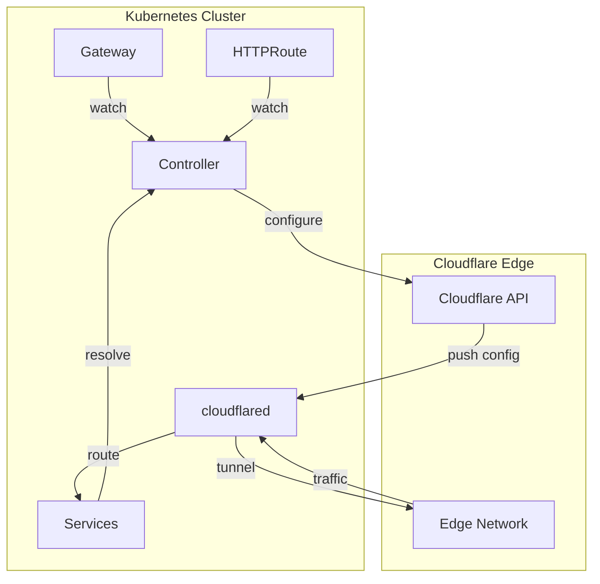
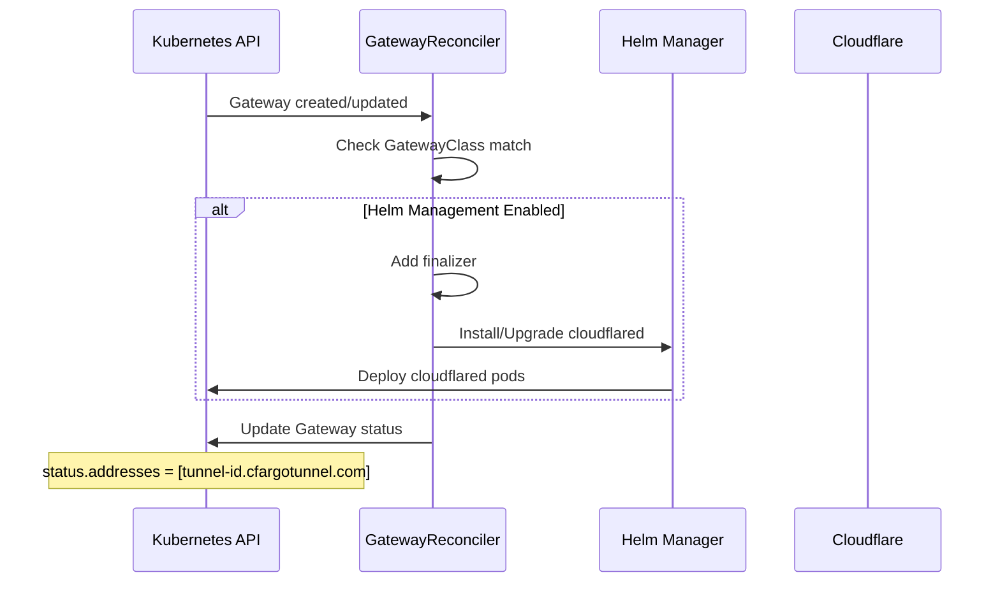
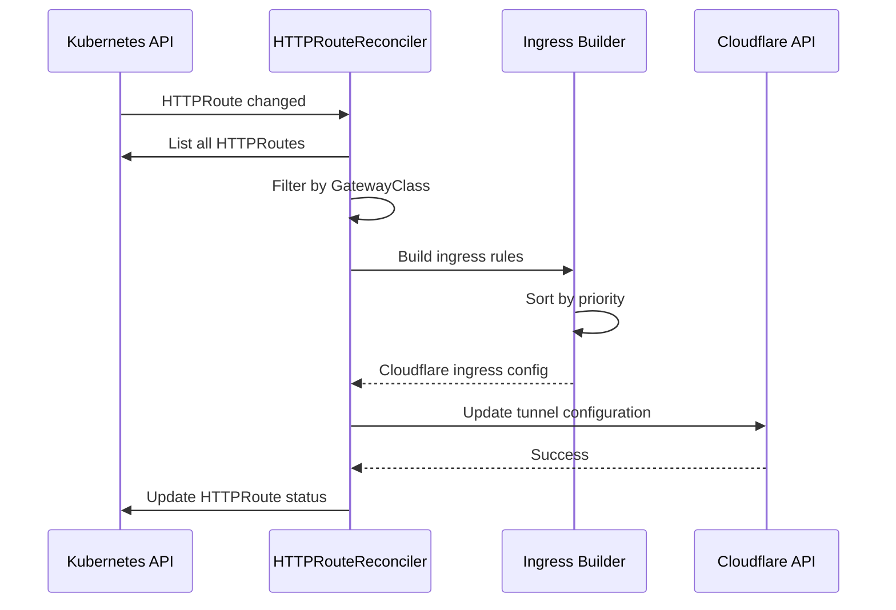
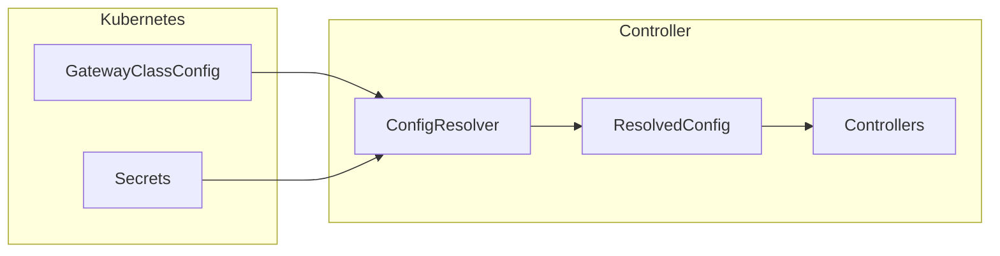
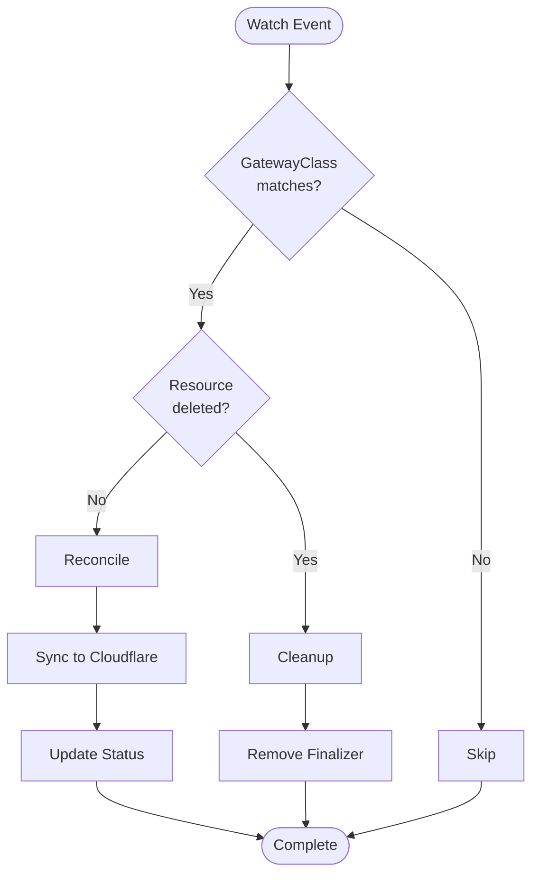
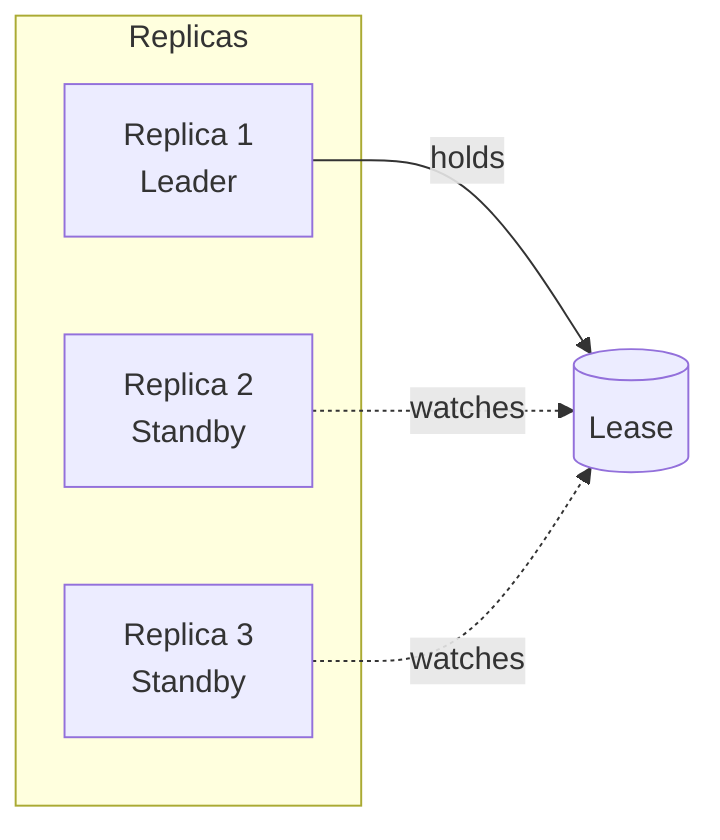

# Architecture

This document describes the internal architecture of the Cloudflare Tunnel
Gateway Controller.

## High-Level Overview

The controller implements the Kubernetes Gateway API to configure Cloudflare
Tunnel ingress rules. It watches Gateway and HTTPRoute resources and translates
them into Cloudflare Tunnel configuration via the Cloudflare API.



## Package Structure

```text
api/v1alpha1/            # GatewayClassConfig CRD types

cmd/controller/
├── main.go              # Entry point, version injection
└── cmd/
    └── root.go          # CLI flags, Cobra command

internal/
├── config/
│   └── resolver.go      # GatewayClassConfig resolution from Secrets
├── controller/
│   ├── manager.go       # Controller manager setup, Run()
│   ├── gateway_controller.go    # Gateway reconciler
│   ├── httproute_controller.go  # HTTPRoute reconciler
│   └── gatewayclassconfig_controller.go  # GatewayClassConfig reconciler
├── dns/
│   └── detect.go        # Cluster domain auto-detection
├── ingress/
│   └── builder.go       # HTTPRoute → Cloudflare rules conversion
└── helm/
    ├── manager.go       # Helm SDK operations
    ├── cloudflared.go   # cloudflared chart values builder
    └── constants.go     # Chart reference, timeouts
```

## Components

### GatewayClassConfig

Cluster-scoped Custom Resource Definition (CRD) that provides tunnel
configuration:

- **API Group**: `cf.k8s.lex.la/v1alpha1`
- **Referenced by**: GatewayClass via `spec.parametersRef`
- **Configuration**: Cloudflare credentials, tunnel ID, cloudflared settings

```yaml
apiVersion: cf.k8s.lex.la/v1alpha1
kind: GatewayClassConfig
metadata:
  name: cloudflare-tunnel-config
spec:
  tunnelID: "550e8400-e29b-41d4-a716-446655440000"
  cloudflareCredentialsSecretRef:
    name: cloudflare-credentials
  tunnelTokenSecretRef:
    name: cloudflare-tunnel-token
  cloudflared:
    enabled: true
    awg:
      secretName: awg-config  # Optional: enables AWG sidecar
```

### ConfigResolver

Resolves GatewayClassConfig from GatewayClass `parametersRef`:

1. Reads GatewayClassConfig by name from parametersRef
2. Fetches Cloudflare credentials from referenced Secret
3. Fetches tunnel token from referenced Secret (if cloudflared.enabled)
4. Auto-detects account ID via Cloudflare API if not specified

### GatewayReconciler

Watches Gateway resources and performs the following:

1. **Filtering**: Only processes Gateways with matching `gatewayClassName`
2. **Finalizers**: Adds finalizer for cleanup when Helm management is enabled
3. **Helm Management**: Deploys/upgrades cloudflared via Helm chart
4. **Status Update**: Sets Gateway address to `<tunnel-id>.cfargotunnel.com`



### HTTPRouteReconciler

Watches HTTPRoute resources and synchronizes them to Cloudflare:

1. **Filtering**: Only processes routes referencing managed Gateways
2. **Full Sync**: On any change, rebuilds entire tunnel configuration
3. **API Update**: Pushes configuration to Cloudflare API
4. **Status Update**: Sets route acceptance conditions



### Ingress Builder

Converts HTTPRoute specs to Cloudflare Tunnel ingress rules:

| HTTPRoute Field | Cloudflare Rule Field |
|-----------------|----------------------|
| `spec.hostnames[]` | `hostname` |
| `rules[].matches[].path` | `path` (with wildcard for prefix) |
| `rules[].backendRefs[]` | `service` (cluster DNS URL) |

**Rule Ordering**:

1. Alphabetically by hostname
2. Exact matches before prefix matches
3. Longer paths before shorter paths

### Helm Manager

Manages cloudflared deployment lifecycle:

- **Chart Source**: `oci://ghcr.io/lexfrei/charts/cloudflare-tunnel`
- **Auto-upgrade**: Detects and upgrades to latest stable version
- **Values Builder**: Configures tunnel token, protocol, AWG sidecar

## Data Flow

### Configuration Flow



### Reconciliation Flow



## Error Handling

The controller follows these error handling patterns:

1. **Retryable Errors**: Return `ctrl.Result{Requeue: true}` for transient
   failures
2. **Permanent Errors**: Log error and update resource status condition
3. **API Errors**: Wrapped with context using `cockroachdb/errors`
4. **Not Found**: Silently ignore (resource was deleted)

## Leader Election

When running multiple replicas for high availability:

- Only one replica is the active leader
- Leader acquires lease in `coordination.k8s.io/leases`
- Other replicas wait in standby mode
- Automatic failover on leader failure



## Security Considerations

| Aspect | Implementation |
|--------|----------------|
| **API Token** | Stored in Kubernetes Secret, mounted as environment variable |
| **RBAC** | Minimal permissions following least-privilege principle |
| **Network** | Controller only needs egress to Cloudflare API |
| **Container** | Runs as non-root user (UID 65534) with read-only filesystem |

## Key Dependencies

- `sigs.k8s.io/controller-runtime` - Kubernetes controller framework
- `sigs.k8s.io/gateway-api` - Gateway API types
- `github.com/cloudflare/cloudflare-go/v4` - Cloudflare API client
- `helm.sh/helm/v3` - Helm SDK for cloudflared deployment
- `github.com/cockroachdb/errors` - Error wrapping
