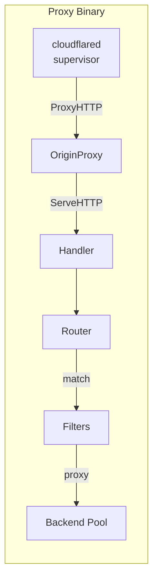
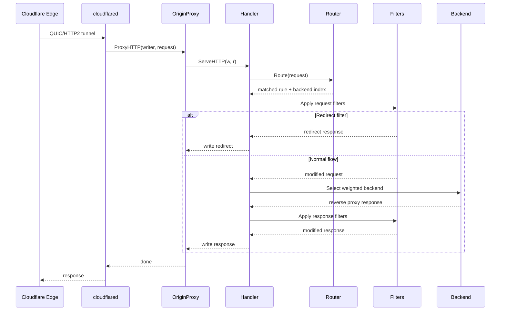

# Proxy Architecture

This document describes the internal architecture of the L7 proxy data plane.

## Overview

The proxy sits between cloudflared tunnel transport and backend Kubernetes
services. It implements full Gateway API HTTPRoute routing locally, removing
the limitations of Cloudflare's tunnel ingress API.



## Packages

```text
internal/
├── proxy/
│   ├── config.go      # ProxyConfig, RouteRule, RouteMatch types
│   ├── matcher.go     # Path/header/query/method matchers
│   ├── router.go      # Routing table with atomic config swap
│   ├── filter.go      # Request/response filters (headers, redirect, rewrite, mirror)
│   ├── handler.go     # http.Handler: match → filter → proxy → response filter
│   └── api.go         # Config API (PUT/GET /config, /healthz, /readyz)
│
├── tunnel/
│   ├── origin.go      # GatewayOriginProxy (connection.OriginProxy)
│   └── bootstrap.go   # Tunnel startup, token parsing, supervisor config
│
└── cmd/proxy/
    └── main.go        # Binary entry point (tunnel mode / standalone mode)
```

## Request Flow



## Routing Table

The router uses `atomic.Pointer[routingTable]` for lock-free reads during
config updates:

- **Exact hosts**: `map[string][]*compiledRule` for O(1) hostname lookup
- **Wildcard hosts**: `[]wildcardEntry` for `*.example.com` patterns
- **Default rules**: Fallback rules without hostname

### Precedence (Gateway API spec)

1. Longest hostname (exact before wildcard)
2. Longest path match
3. Method present
4. Most header matches
5. Most query parameter matches

## Config Push

The controller pushes routing config via HTTP:

```text
Controller  ──PUT /config──▶  Proxy Config API
                                    │
                              compile routing table
                                    │
                              atomic.Pointer.Store()
                                    │
                              lock-free reads ◀── request goroutines
```

Config versioning prevents stale updates. Each push includes a monotonically
increasing version number; the proxy rejects versions older than current.

## Filters

| Filter | Phase | Behavior |
| --- | --- | --- |
| RequestHeaderModifier | Request | Add/set/remove request headers |
| ResponseHeaderModifier | Response | Add/set/remove response headers |
| RequestRedirect | Request | Return redirect response (short-circuit) |
| URLRewrite | Request | Modify URL path and/or host |
| RequestMirror | Request | Clone request to mirror backend (async) |

## Backend Selection

Weighted random selection using cumulative weight sums:

1. Precompute cumulative weights: `[30, 30+70] = [30, 100]`
2. Generate random number in `[0, totalWeight)`
3. Linear scan in cumulative weight array
4. Each backend has its own `*http.Transport` with connection pooling

## Tunnel Integration

`GatewayOriginProxy` implements `connection.OriginProxy`:

- `ProxyHTTP`: Delegates to `proxy.Handler.ServeHTTP`
- `ProxyTCP`: Returns error (TCPRoute is future work)

`StartTunnel` builds the full cloudflared supervisor config:

- Parse tunnel token (base64 JSON)
- Build edge TLS configs (Cloudflare root CAs + system pool)
- Create protocol selector (auto: QUIC preferred)
- **In-process mode** (default): Set `OverrideProxy` on supervisor config to
  route all requests directly to `proxy.Handler`, bypassing ingress rules entirely
- **Standalone mode**: Build catch-all ingress to `http://localhost:PROXY_PORT`
  so cloudflared forwards traffic to the local proxy HTTP server
- Start `supervisor.StartTunnelDaemon`
