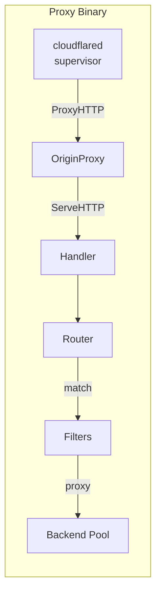
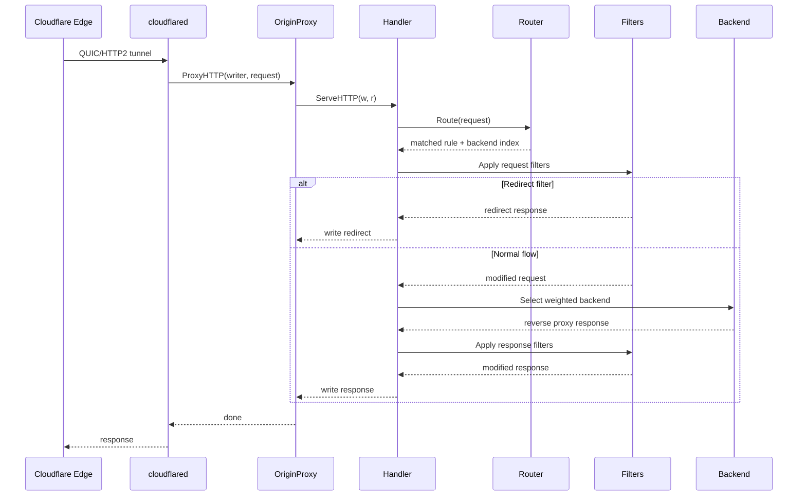

# Proxy Architecture

This document describes the internal architecture of the L7 proxy data plane.

## Overview

The proxy sits between cloudflared tunnel transport and backend Kubernetes services. It implements full Gateway API HTTPRoute routing locally, removing the limitations of Cloudflare's tunnel ingress API.



## Packages

```text
internal/
├── proxy/
│   ├── config.go      # ProxyConfig, RouteRule, RouteMatch types
│   ├── matcher.go     # Path/header/query/method matchers
│   ├── router.go      # Routing table with atomic config swap
│   ├── filter.go      # Request/response filters (headers, redirect, rewrite, mirror)
│   ├── handler.go     # http.Handler: match → filter → proxy → response filter
│   ├── api.go         # Config API (PUT/GET /config, /healthz, /readyz)
│   ├── converter.go   # Gateway API HTTPRoute → proxy config conversion
│   └── pusher.go      # HTTP client for pushing config to proxy replicas
│
├── tunnel/
│   ├── origin.go      # GatewayOriginProxy (connection.OriginProxy)
│   └── bootstrap.go   # Tunnel startup, token parsing, supervisor config
│
└── cmd/proxy/
    └── main.go        # Binary entry point (tunnel mode / standalone mode)
```

## Request Flow



## Routing Table

The router uses `atomic.Pointer[routingTable]` for lock-free reads during config updates:

- **Exact hosts**: `map[string][]*compiledRule` for O(1) hostname lookup
- **Wildcard hosts**: `[]wildcardEntry` for `*.example.com` patterns
- **Default rules**: Fallback rules without hostname

### Precedence (Gateway API spec)

1. Longest hostname (exact before wildcard)
2. Longest path match
3. Method present
4. Most header matches
5. Most query parameter matches

## Config Push

The controller pushes routing config via HTTP:

```text
Controller  ──PUT /config──▶  Proxy Config API
                                    │
                              compile routing table
                                    │
                              atomic.Pointer.Store()
                                    │
                              lock-free reads ◀── request goroutines
```

Config versioning prevents stale updates. Each push includes a monotonically increasing version number; the proxy rejects versions older than current.

## Filters

| Filter | Phase | Behavior |
| --- | --- | --- |
| RequestHeaderModifier | Request | Add/set/remove request headers |
| ResponseHeaderModifier | Response | Add/set/remove response headers |
| RequestRedirect | Request | Return redirect response (short-circuit) |
| URLRewrite | Request | Modify URL path and/or host |
| RequestMirror | Request | Clone request to mirror backend (async) |

## Backend Selection

Weighted random selection using cumulative weight sums:

1. Precompute cumulative weights: `[30, 30+70] = [30, 100]`
2. Generate random number in `[0, totalWeight)`
3. Linear scan in cumulative weight array
4. Each backend has its own `*http.Transport` with connection pooling

## Tunnel Integration

`GatewayOriginProxy` implements `connection.OriginProxy`:

- `ProxyHTTP`: Delegates to `proxy.Handler.ServeHTTP`
- `ProxyTCP`: Returns error (TCPRoute is future work)

`StartTunnel` builds the full cloudflared supervisor config:

- Parse tunnel token (base64 JSON)
- Build edge TLS configs (Cloudflare root CAs + system pool)
- Create protocol selector (auto: QUIC preferred)
- **In-process mode** (default): Set `OverrideProxy` on supervisor config to route all requests directly to `proxy.Handler`, bypassing ingress rules entirely
- **Standalone mode**: Build catch-all ingress to `http://localhost:PROXY_PORT` so cloudflared forwards traffic to the local proxy HTTP server
- Start `supervisor.StartTunnelDaemon`

## Tunnel-Mode Response Writer Semantics

When the proxy runs in in-process mode (production default), the `http.ResponseWriter` `proxy.Handler.ServeHTTP` receives is `cloudflared.connection.http2RespWriter`, NOT a stdlib HTTP/1.1 writer. The two have materially different contracts; missing the gap shipped a production-only WebSocket regression that two rounds of pre-merge code review failed to catch.

| Behaviour | `httptest.NewServer` (HTTP/1.1) | `cloudflared.connection.http2RespWriter` |
| --- | --- | --- |
| `Hijack` before `WriteHeader` | Succeeds — returns the raw TCP conn | **Fails** with `status not yet written before attempting to hijack connection` |
| `WriteHeader(101)` on the wire | `HTTP/1.1 101 Switching Protocols` literal | Translated to status 200 (HTTP/2 has no 1xx); the Cloudflare edge unpacks the 200 back to 101 for HTTP/1.1 clients on the wire (verified empirically by the WebSocket round-trip — the edge translation itself lives in closed-source Cloudflare code) |
| Headers wire format | RFC 7230 ASCII | Serialised into a single `cf-cloudflared-response-headers` blob the edge unpacks (`vendor/github.com/cloudflare/cloudflared/connection/header.go` `ResponseUserHeaders`) |

Practical consequences:

- `httputil.ReverseProxy.handleUpgradeResponse` calls `Hijack` BEFORE `WriteHeader`. Over HTTP/2 that fails; `ReverseProxy`'s default error handler then writes 502 and the client sees a 502 (or a Cloudflare edge-rewritten 403). This is the bug that motivated the custom `proxyWebSocketUpgrade` path in `handler_websocket.go`.
- Writing a status, hijacking, and bidirectionally piping bytes is the correct shape for WebSocket and any future upgrade flow over the tunnel; do NOT route them through `httputil.ReverseProxy`.

### Required test fixture for tunnel-mode paths

Any proxy code that reads, writes, or hijacks the response MUST be covered by a test that runs through `fakeCloudflaredRespWriter` (`internal/proxy/handler_tunnelfake_test.go`), in addition to any existing `httptest.NewServer`-based coverage. The fake enforces the HTTP/2 contract above and reproduces production failures deterministically:

- `Hijack` rejects unless `statusWritten == true`.
- `WriteHeader(101)` is recorded as 200.
- `WriteHeader` after `Hijack` is a silent no-op (mirroring cloudflared's warn-and-return).
- Second `Hijack` returns `http.ErrHijacked`.

Use the fake from the start of design — not as a last-mile add-on during local CI gates. If a test passes against `httptest.NewServer` and you have no fake-fixture coverage of the same code path, treat the green test as inconclusive for production behaviour.

### Re-vendoring discipline

When bumping the `lexfrei/cloudflared` fork (see CLAUDE.md `Cloudflared Fork`), re-verify each contract row in the table above against the new vendored sources. The fake's behaviour is pinned to the snapshot of cloudflared at fake-authoring time; an upstream rename or semantic change is silent until detected by hand. Tests that string-match the cloudflared error message ALSO won't catch drift because they assert against the fake's own copy of the string.

Fix-up points to re-verify on every cloudflared rebase — at least one per contract row in the table above, in the same order:

- **Hijack precondition** — `fakeCloudflaredRespWriter.Hijack` and the `errFakeStatusNotWritten` constant in `internal/proxy/handler_tunnelfake_test.go`. The fake's error message is pinned to the snapshot of cloudflared at fake-authoring time; if upstream renames the message, update both the constant and any assertion that string-matches against it.
- **101 → 200 translation** — `fakeCloudflaredRespWriter.WriteHeader` mirrors `cloudflared.connection.http2RespWriter.WriteRespHeaders`. Both must keep collapsing `http.StatusSwitchingProtocols` to `http.StatusOK`; if cloudflared changes the translation rule (e.g. adds a different sentinel for Extended CONNECT WebSocket), update the fake to match.
- **WriteHeader after Hijack** — the silent-no-op branch in the fake's `WriteHeader` (cloudflared logs a warning and returns; the fake drops the warning). Re-verify the upstream still no-ops; if it starts panicking or writing a second status, mirror the new behaviour.
- **Second `Hijack` returns `ErrHijacked`** — the fake's `hijacked` flag short-circuits with the stdlib `http.ErrHijacked` sentinel. Re-verify cloudflared still returns the same sentinel (and not a custom error) for the second-call case.

Treat the table as the authoritative contract and the list above as a mechanical checklist; if upstream adds a new contract row, the table, the fake, and this checklist all need a matching update.
