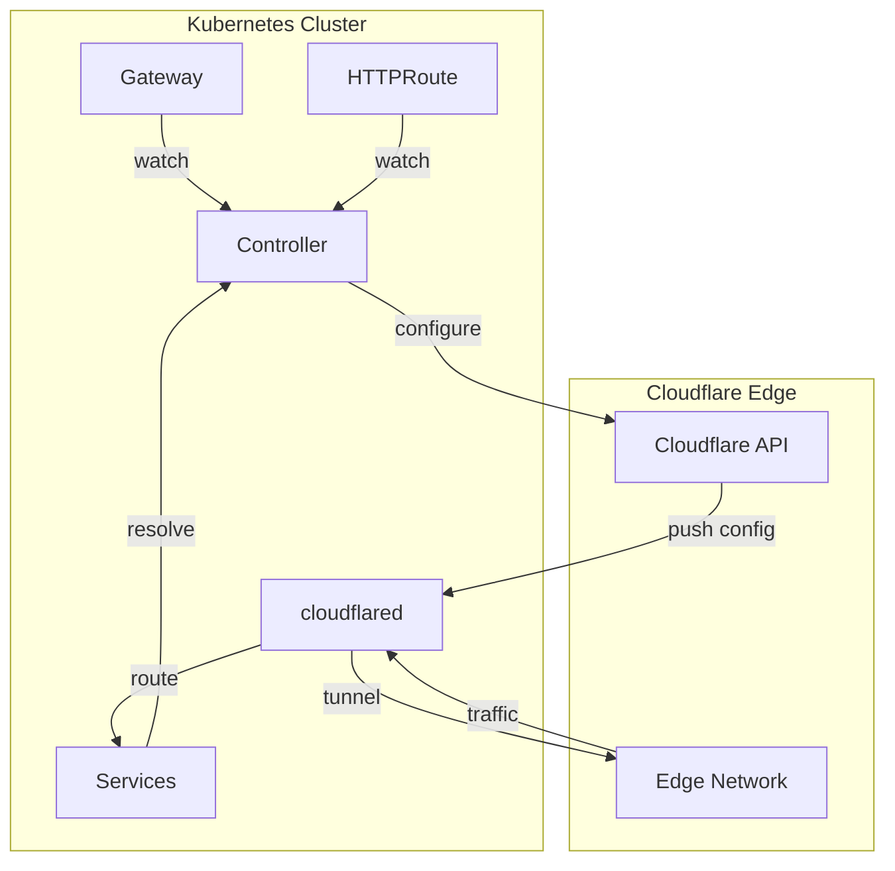

# Gateway API

This section documents the Gateway API implementation in the Cloudflare Tunnel
Gateway Controller.

## Overview

The controller implements the [Kubernetes Gateway API](https://gateway-api.sigs.k8s.io/)
to configure Cloudflare Tunnel ingress rules. It watches Gateway and Route
resources and translates them into Cloudflare Tunnel configuration via the
Cloudflare API.

## Supported Resources

| Resource | API Version | Status |
|----------|-------------|--------|
| GatewayClass | `gateway.networking.k8s.io/v1` | Supported |
| Gateway | `gateway.networking.k8s.io/v1` | Supported |
| HTTPRoute | `gateway.networking.k8s.io/v1` | Supported |
| GRPCRoute | `gateway.networking.k8s.io/v1` | Supported |
| TCPRoute | `gateway.networking.k8s.io/v1alpha2` | Not supported |
| TLSRoute | `gateway.networking.k8s.io/v1alpha2` | Not supported |
| UDPRoute | `gateway.networking.k8s.io/v1alpha2` | Not supported |

## Sections

-   :material-format-list-checks:{ .lg .middle } **Supported Resources**

    ---

    Detailed feature support matrix for each Gateway API resource.

    [:octicons-arrow-right-24: Supported Resources](supported-resources.md)

-   :material-routes:{ .lg .middle } **HTTPRoute**

    ---

    HTTP routing examples and configuration patterns.

    [:octicons-arrow-right-24: HTTPRoute](httproute.md)

-   :material-api:{ .lg .middle } **GRPCRoute**

    ---

    gRPC routing with service and method matching.

    [:octicons-arrow-right-24: GRPCRoute](grpcroute.md)

-   :material-key:{ .lg .middle } **ReferenceGrant**

    ---

    Cross-namespace backend references and security.

    [:octicons-arrow-right-24: ReferenceGrant](referencegrant.md)

-   :material-alert-circle:{ .lg .middle } **Limitations**

    ---

    Known limitations and workarounds.

    [:octicons-arrow-right-24: Limitations](limitations.md)

## How It Works

## Key Concepts

!!! info "TLS Termination"

    Cloudflare Tunnel terminates TLS at Cloudflare's edge network.
    Gateway listener configuration for ports, protocols, and TLS settings
    has no effect on routing behavior.

!!! info "Full Sync"

    Any change to HTTPRoute or GRPCRoute triggers a full configuration
    sync to Cloudflare Tunnel. The controller rebuilds the entire ingress
    configuration on each reconciliation.
