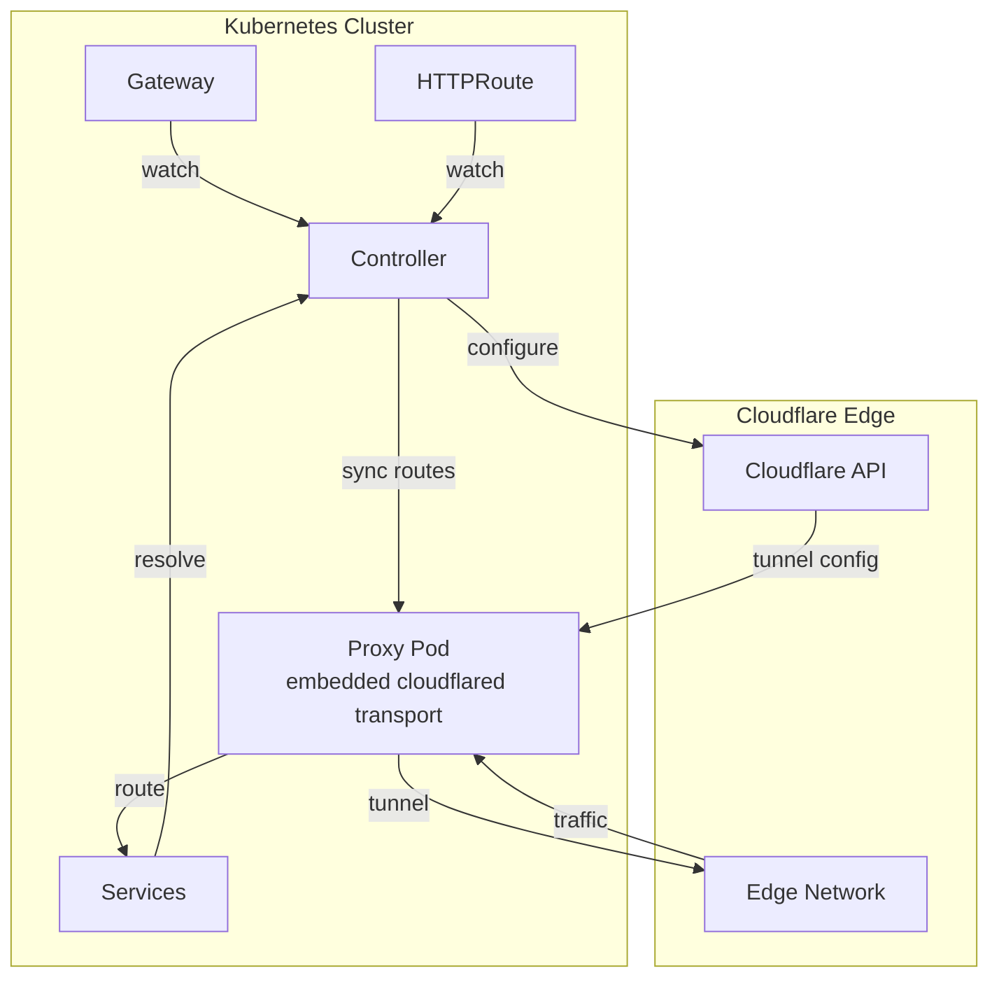

# Gateway API

This section documents the Gateway API implementation in the Cloudflare Tunnel Gateway Controller.

## Overview

The controller implements the [Kubernetes Gateway API](https://gateway-api.sigs.k8s.io/) to manage an in-process L7 reverse proxy data plane. It watches Gateway and Route resources, pushes routing configuration to the in-cluster proxy, and registers tunnel endpoints with the Cloudflare API for DNS/edge connectivity. All L7 routing, matching, and filter logic executes in the in-cluster proxy; the Cloudflare API is used only for edge configuration.

## Supported Resources

| Resource | API Version | Status |
|----------|-------------|--------|
| GatewayClass | `gateway.networking.k8s.io/v1` | Supported |
| Gateway | `gateway.networking.k8s.io/v1` | Supported |
| HTTPRoute | `gateway.networking.k8s.io/v1` | Supported |
| GRPCRoute | `gateway.networking.k8s.io/v1` | Supported — see [GRPCRoute](grpcroute.md) |
| TCPRoute | `gateway.networking.k8s.io/v1alpha2` | Not supported |
| TLSRoute | `gateway.networking.k8s.io/v1alpha2` | Not supported |
| UDPRoute | `gateway.networking.k8s.io/v1alpha2` | Not supported |

## Sections

-   :material-format-list-checks:{ .lg .middle } **Supported Resources**

    ---

    Detailed feature support matrix for each Gateway API resource.

    [:octicons-arrow-right-24: Supported Resources](supported-resources.md)

-   :material-routes:{ .lg .middle } **HTTPRoute**

    ---

    HTTP routing examples and configuration patterns.

    [:octicons-arrow-right-24: HTTPRoute](httproute.md)

-   :material-key:{ .lg .middle } **ReferenceGrant**

    ---

    Cross-namespace backend references and security.

    [:octicons-arrow-right-24: ReferenceGrant](referencegrant.md)

-   :material-alert-circle:{ .lg .middle } **Limitations**

    ---

    Known limitations and workarounds.

    [:octicons-arrow-right-24: Limitations](limitations.md)

## How It Works

```mermaid
flowchart TB
    subgraph Kubernetes["Kubernetes Cluster"]
        GW[Gateway]
        HR[HTTPRoute]
        SVC[Services]
        CTRL[Controller]
        PROXY[Proxy Pod<br/>embedded cloudflared transport]
    end

    subgraph Cloudflare["Cloudflare Edge"]
        API[Cloudflare API]
        EDGE[Edge Network]
    end

    GW -->|watch| CTRL
    HR -->|watch| CTRL
    SVC -->|resolve| CTRL
    CTRL -->|configure| API
    CTRL -->|sync routes| PROXY
    API -->|tunnel config| PROXY
    PROXY -->|tunnel| EDGE
    EDGE -->|traffic| PROXY
    PROXY -->|route| SVC
```

## Key Concepts

!!! info "TLS Termination"

    Cloudflare Tunnel terminates TLS at Cloudflare's edge network; in-cluster TLS termination settings on Gateway listeners have no effect. Listener port and protocol still govern route binding per the Gateway API spec.

!!! info "Full Sync"

    Any change to an HTTPRoute or GRPCRoute triggers a full configuration sync. The controller rebuilds the entire route table and pushes the merged config to every proxy replica (via `PUT /config`), then updates edge registration with the Cloudflare API.
