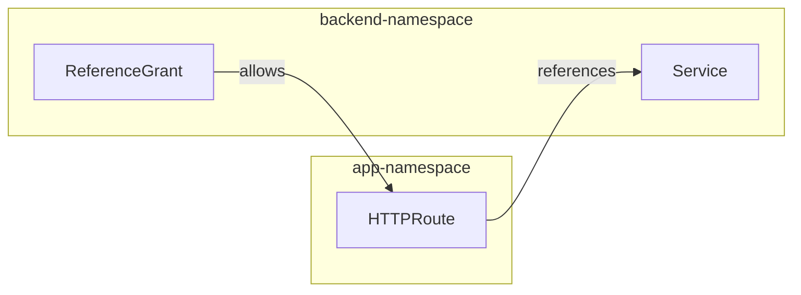

# ReferenceGrant

ReferenceGrant enables cross-namespace backend references in HTTPRoute and
GRPCRoute resources. This is a security feature that requires explicit
permission for a Route in one namespace to reference a Service in another
namespace.

## How It Works

1. ReferenceGrant must be created in the **target namespace** (where the
   Service is)
2. It grants permission to routes in the **source namespace** to reference
   Services in the target namespace
3. Without a ReferenceGrant, cross-namespace backend references are denied
   with `ResolvedRefs=False` status



## Basic Example

```yaml
---
# ReferenceGrant must be in the target namespace (where the Service is)
apiVersion: gateway.networking.k8s.io/v1beta1
kind: ReferenceGrant
metadata:
  name: allow-app-to-backend
  namespace: backend-namespace  # Target namespace
spec:
  from:
    - group: gateway.networking.k8s.io
      kind: HTTPRoute
      namespace: app-namespace  # Source namespace
  to:
    - group: ""  # Core API group (empty string for Services)
      kind: Service
---
# HTTPRoute in source namespace
apiVersion: gateway.networking.k8s.io/v1
kind: HTTPRoute
metadata:
  name: cross-ns-route
  namespace: app-namespace
spec:
  parentRefs:
    - name: cloudflare-tunnel
      namespace: cloudflare-tunnel-system
  hostnames:
    - myapp.example.com
  rules:
    - backendRefs:
        - name: backend-service
          namespace: backend-namespace  # Cross-namespace reference
          port: 8080
```

## Field Reference

### `spec.from` (required)

Defines which resources can reference targets in this namespace.

| Field | Description |
|-------|-------------|
| `group` | API group of the referencing resource (e.g., `gateway.networking.k8s.io`) |
| `kind` | Kind of the referencing resource (`HTTPRoute` or `GRPCRoute`) |
| `namespace` | Namespace of the referencing resource |

### `spec.to` (required)

Defines which resources can be referenced.

| Field | Description |
|-------|-------------|
| `group` | API group of the target resource (`""` for core/Services) |
| `kind` | Kind of the target resource (`Service`) |
| `name` | Optional: specific resource name (if omitted, all resources of this kind are allowed) |

## Allow All Namespaces

To allow any namespace to reference Services in this namespace:

```yaml
apiVersion: gateway.networking.k8s.io/v1beta1
kind: ReferenceGrant
metadata:
  name: allow-all-namespaces
  namespace: shared-services
spec:
  from:
    - group: gateway.networking.k8s.io
      kind: HTTPRoute
      namespace: "*"  # Not supported - use multiple entries
  to:
    - group: ""
      kind: Service
```

!!! warning "Wildcard Not Supported"

    The Gateway API does not support wildcards in `namespace`. You must
    create individual entries for each namespace, or create the
    ReferenceGrant in each source namespace.

## Allow Specific Service

Restrict access to a specific Service:

```yaml
apiVersion: gateway.networking.k8s.io/v1beta1
kind: ReferenceGrant
metadata:
  name: allow-specific-service
  namespace: backend-namespace
spec:
  from:
    - group: gateway.networking.k8s.io
      kind: HTTPRoute
      namespace: app-namespace
  to:
    - group: ""
      kind: Service
      name: public-api  # Only this service can be referenced
```

## Multiple Source Namespaces

Allow multiple namespaces to reference Services:

```yaml
apiVersion: gateway.networking.k8s.io/v1beta1
kind: ReferenceGrant
metadata:
  name: allow-multiple-namespaces
  namespace: shared-services
spec:
  from:
    - group: gateway.networking.k8s.io
      kind: HTTPRoute
      namespace: frontend
    - group: gateway.networking.k8s.io
      kind: HTTPRoute
      namespace: backend
    - group: gateway.networking.k8s.io
      kind: GRPCRoute
      namespace: grpc-apps
  to:
    - group: ""
      kind: Service
```

## GRPCRoute Example

```yaml
---
apiVersion: gateway.networking.k8s.io/v1beta1
kind: ReferenceGrant
metadata:
  name: allow-grpc-routes
  namespace: grpc-services
spec:
  from:
    - group: gateway.networking.k8s.io
      kind: GRPCRoute
      namespace: app-namespace
  to:
    - group: ""
      kind: Service
---
apiVersion: gateway.networking.k8s.io/v1
kind: GRPCRoute
metadata:
  name: cross-ns-grpc
  namespace: app-namespace
spec:
  parentRefs:
    - name: cloudflare-tunnel
      namespace: cloudflare-tunnel-system
  hostnames:
    - grpc.example.com
  rules:
    - matches:
        - method:
            service: mypackage.UserService
      backendRefs:
        - name: user-grpc-service
          namespace: grpc-services
          port: 50051
```

## Status Conditions

When a cross-namespace reference is denied, the route status shows:

```yaml
status:
  parents:
    - parentRef:
        name: cloudflare-tunnel
        namespace: cloudflare-tunnel-system
      conditions:
        - type: ResolvedRefs
          status: "False"
          reason: RefNotPermitted
          message: "Cross-namespace reference not permitted by ReferenceGrant"
```

## Checking ReferenceGrants

List ReferenceGrants in a namespace:

```bash
kubectl get referencegrant --namespace backend-namespace
```

View details:

```bash
kubectl describe referencegrant allow-app-to-backend --namespace backend-namespace
```

## Troubleshooting

### RefNotPermitted Error

Check that:

1. ReferenceGrant exists in the **target namespace** (where Service is)
2. `from[].namespace` matches the route's namespace
3. `from[].kind` matches the route kind (HTTPRoute or GRPCRoute)
4. `from[].group` is `gateway.networking.k8s.io`
5. `to[].group` is `""` (empty string for core API)
6. `to[].kind` is `Service`

### Common Mistakes

| Mistake | Fix |
|---------|-----|
| ReferenceGrant in wrong namespace | Create in target (Service) namespace |
| Wrong `from.group` | Use `gateway.networking.k8s.io` |
| Wrong `to.group` | Use `""` (empty string) for Services |
| Missing namespace in backendRef | Add explicit `namespace` field |

### Debug Commands

```bash
# Check route status
kubectl get httproute my-route --output jsonpath='{.status.parents[*].conditions}'

# Check ReferenceGrant
kubectl get referencegrant --namespace backend-namespace --output yaml

# Check controller logs
kubectl logs --selector app.kubernetes.io/name=cloudflare-tunnel-gateway-controller \
  --namespace cloudflare-tunnel-system | grep -i reference
```

## Security Considerations

!!! tip "Least Privilege"

    Create ReferenceGrants with the minimum necessary permissions:

    - Specify exact namespaces instead of multiple entries
    - Use `to[].name` to restrict to specific Services when possible
    - Regularly audit ReferenceGrants in shared namespaces

!!! warning "Shared Namespaces"

    Be careful with ReferenceGrants in namespaces containing sensitive
    Services. A ReferenceGrant without `to[].name` allows access to ALL
    Services in that namespace.
