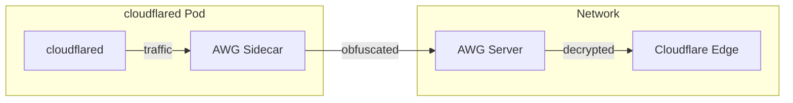

# AmneziaWG Sidecar

This guide walks you through setting up Cloudflare Tunnel with AmneziaWG (AWG)
sidecar for traffic obfuscation.

## Why AWG?

AmneziaWG routes cloudflared traffic through an obfuscated WireGuard tunnel,
making it harder to detect and block Cloudflare Tunnel connections in
restricted networks.

## Prerequisites

- Kubernetes cluster with Gateway API CRDs installed
- Cloudflare Tunnel created in Zero Trust Dashboard
- AWG server configured and accessible

!!! warning "Single Replica Limitation"

    AWG configuration contains unique client identity (private key, address).
    Running multiple replicas with the same config will cause connection
    conflicts. Currently only single replica deployments are supported.

## Step 1: Create Namespace

```bash
kubectl create namespace cloudflare-tunnel-system
```

## Step 2: Create Secrets

### Cloudflare API Credentials

```bash
kubectl create secret generic cloudflare-credentials \
  --namespace cloudflare-tunnel-system \
  --from-literal=api-token="YOUR_API_TOKEN"
```

### Tunnel Token

Get the tunnel token from: Zero Trust Dashboard > Networks > Tunnels > Configure

```bash
kubectl create secret generic cloudflare-tunnel-token \
  --namespace cloudflare-tunnel-system \
  --from-literal=tunnel-token="YOUR_TUNNEL_TOKEN"
```

### AWG Configuration

Create `awg.conf` file with your AWG server configuration:

```ini
[Interface]
Address = 10.x.x.x/32
PrivateKey = YOUR_PRIVATE_KEY
# AWG-specific obfuscation parameters (get from your AWG server)
Jc = 2
Jmin = 10
Jmax = 50
S1 = 32
S2 = 115
H1 = 1313297875
H2 = 13518962
H3 = 1721880616
H4 = 1243767569

[Peer]
PublicKey = SERVER_PUBLIC_KEY
PresharedKey = OPTIONAL_PRESHARED_KEY
# IMPORTANT: AllowedIPs must include ALL Cloudflare IP ranges
AllowedIPs = 173.245.48.0/20, 103.21.244.0/22, 103.22.200.0/22, 103.31.4.0/22, 141.101.64.0/18, 108.162.192.0/18, 190.93.240.0/20, 188.114.96.0/20, 197.234.240.0/22, 198.41.128.0/17, 162.158.0.0/15, 104.16.0.0/13, 104.24.0.0/14, 172.64.0.0/13, 131.0.72.0/22
Endpoint = your-awg-server:port
PersistentKeepalive = 25
```

!!! danger "AllowedIPs Critical"

    AllowedIPs MUST include ALL Cloudflare IP ranges from
    <https://www.cloudflare.com/ips/>. Missing ranges will cause
    connection failures.

Then create the secret:

```bash
kubectl create secret generic awg-config \
  --namespace cloudflare-tunnel-system \
  --from-file=wg0.conf=awg.conf
```

## Step 3: Install Controller with AWG

Create `awg-values.yaml`:

```yaml
gatewayClassConfig:
  create: true
  tunnelID: "your-tunnel-uuid"
  cloudflareCredentialsSecretRef:
    name: cloudflare-credentials
  tunnelTokenSecretRef:
    name: cloudflare-tunnel-token
  cloudflared:
    enabled: true
    awg:
      secretName: awg-config

# Required for AWG - needs NET_ADMIN capability
podSecurityContext:
  runAsNonRoot: false
  runAsUser: 0

securityContext:
  allowPrivilegeEscalation: true
  capabilities:
    add:
      - NET_ADMIN
    drop: []
  readOnlyRootFilesystem: false
```

Install the controller:

```bash
helm install cloudflare-tunnel-gateway-controller \
  oci://ghcr.io/lexfrei/cloudflare-tunnel-gateway-controller/chart \
  --namespace cloudflare-tunnel-system \
  --values awg-values.yaml
```

## Step 4: Create Gateway and HTTPRoute

```yaml
---
apiVersion: gateway.networking.k8s.io/v1
kind: Gateway
metadata:
  name: cloudflare-tunnel
  namespace: cloudflare-tunnel-system
spec:
  gatewayClassName: cloudflare-tunnel
  listeners:
    - name: https
      port: 443
      protocol: HTTPS
      allowedRoutes:
        namespaces:
          from: All
---
apiVersion: gateway.networking.k8s.io/v1
kind: HTTPRoute
metadata:
  name: my-app
  namespace: default
spec:
  parentRefs:
    - name: cloudflare-tunnel
      namespace: cloudflare-tunnel-system
  hostnames:
    - app.example.com
  rules:
    - backendRefs:
        - name: my-service
          port: 80
```

## Security Considerations

AWG sidecar requires elevated privileges:

| Setting | Value | Reason |
|---------|-------|--------|
| `runAsUser` | `0` | Root required for network interface creation |
| `NET_ADMIN` | Required | WireGuard interface management |
| `allowPrivilegeEscalation` | `true` | Capability elevation |

!!! note "Scope of Elevated Privileges"

    These permissions are only needed for the cloudflared pod with AWG
    sidecar, not for the controller itself.

## Troubleshooting

### AWG interface not created

Check that NET_ADMIN capability is granted:

```bash
kubectl get pod --namespace cloudflare-tunnel-system \
  --selector app=cloudflared --output yaml | grep -A5 capabilities
```

### Tunnel not connecting

Verify AllowedIPs includes all Cloudflare IP ranges:

```bash
kubectl get secret awg-config --namespace cloudflare-tunnel-system \
  --output jsonpath='{.data.wg0\.conf}' | base64 -d | grep AllowedIPs
```

Compare with current Cloudflare ranges: <https://www.cloudflare.com/ips/>

### DNS not resolving inside pod

AWG sidecar preserves cluster DNS configuration. Verify DNS is working:

```bash
kubectl exec --namespace cloudflare-tunnel-system \
  deploy/cloudflared -- nslookup kubernetes.default.svc.cluster.local
```

### Check AWG sidecar logs

```bash
kubectl logs --namespace cloudflare-tunnel-system \
  deploy/cloudflared --container awg-sidecar
```

### Check cloudflared logs

```bash
kubectl logs --namespace cloudflare-tunnel-system \
  deploy/cloudflared --container cloudflared
```

## Architecture



Traffic flow:

1. cloudflared sends traffic to AWG sidecar
2. AWG sidecar encrypts and obfuscates traffic
3. Traffic is sent to AWG server
4. AWG server decrypts and forwards to Cloudflare
