# External-DNS Integration

This guide covers integrating the Cloudflare Tunnel Gateway Controller with
[external-dns](https://github.com/kubernetes-sigs/external-dns) for automatic
DNS record management.

## Overview

The controller sets `status.addresses` on the Gateway with the tunnel CNAME
(`TUNNEL_ID.cfargotunnel.com`). When external-dns is configured with Gateway
API source, it automatically creates DNS records for your HTTPRoute hostnames.

## Prerequisites

- Cloudflare Tunnel Gateway Controller installed
- external-dns installed and configured for Cloudflare
- Cloudflare API token with DNS edit permissions

## external-dns Configuration

### Helm Values

```yaml
# external-dns values.yaml
provider:
  name: cloudflare

env:
  - name: CF_API_TOKEN
    valueFrom:
      secretKeyRef:
        name: cloudflare-dns-token
        key: api-token

sources:
  - gateway-httproute
  - gateway-grpcroute

extraArgs:
  - --gateway-namespace=cloudflare-tunnel-system
  - --gateway-label-filter=app.kubernetes.io/name=cloudflare-tunnel-gateway-controller
```

### API Token Permissions

The external-dns API token needs:

| Scope | Permission | Access |
|-------|------------|--------|
| Zone | DNS | Edit |
| Zone | Zone | Read |

!!! note "Separate Tokens"

    Use separate API tokens for the tunnel controller (Tunnel Edit) and
    external-dns (DNS Edit) following the principle of least privilege.

## HTTPRoute Annotations

Add annotations to HTTPRoute for DNS configuration:

```yaml
apiVersion: gateway.networking.k8s.io/v1
kind: HTTPRoute
metadata:
  name: my-app
  annotations:
    # Enable Cloudflare proxy (orange cloud)
    external-dns.alpha.kubernetes.io/cloudflare-proxied: "true"
    # Custom TTL (seconds)
    external-dns.alpha.kubernetes.io/ttl: "300"
spec:
  parentRefs:
    - name: cloudflare-tunnel
      namespace: cloudflare-tunnel-system
  hostnames:
    - app.example.com
  rules:
    - backendRefs:
        - name: my-service
          port: 80
```

## Common Annotations

| Annotation | Description | Example |
|------------|-------------|---------|
| `external-dns.alpha.kubernetes.io/cloudflare-proxied` | Enable Cloudflare proxy | `"true"` |
| `external-dns.alpha.kubernetes.io/ttl` | DNS record TTL | `"300"` |
| `external-dns.alpha.kubernetes.io/target` | Override CNAME target | `custom.example.com` |
| `external-dns.alpha.kubernetes.io/hostname` | Override hostname | `override.example.com` |

## How It Works

```mermaid
sequenceDiagram
    participant User
    participant K8s as Kubernetes
    participant Ctrl as Controller
    participant ExtDNS as external-dns
    participant CF as Cloudflare

    User->>K8s: Create HTTPRoute
    K8s->>Ctrl: Watch event
    Ctrl->>CF: Update tunnel config
    Ctrl->>K8s: Update Gateway status.addresses
    K8s->>ExtDNS: Watch Gateway/HTTPRoute
    ExtDNS->>CF: Create DNS CNAME record
    Note over CF: app.example.com → TUNNEL_ID.cfargotunnel.com
```



1. User creates HTTPRoute with hostnames
2. Controller updates tunnel configuration in Cloudflare
3. Controller sets Gateway `status.addresses` to tunnel CNAME
4. external-dns watches Gateway and HTTPRoute
5. external-dns creates CNAME record pointing to tunnel

## Verifying DNS Records

Check that external-dns created the record:

```bash
# Check external-dns logs
kubectl logs --selector app.kubernetes.io/name=external-dns

# Query DNS
dig app.example.com CNAME

# Expected output
# app.example.com. 300 IN CNAME abc123.cfargotunnel.com.
```

## Troubleshooting

### DNS Record Not Created

1. Check external-dns logs for errors:

```bash
kubectl logs --selector app.kubernetes.io/name=external-dns | grep -i error
```

2. Verify Gateway has address set:

```bash
kubectl get gateway cloudflare-tunnel --namespace cloudflare-tunnel-system \
  --output jsonpath='{.status.addresses[*].value}'
```

3. Verify HTTPRoute is accepted:

```bash
kubectl get httproute my-app --output jsonpath='{.status.parents[*].conditions}'
```

### Proxy Status Not Applied

Ensure the annotation is on the HTTPRoute, not the Gateway:

```yaml
# Correct - annotation on HTTPRoute
apiVersion: gateway.networking.k8s.io/v1
kind: HTTPRoute
metadata:
  annotations:
    external-dns.alpha.kubernetes.io/cloudflare-proxied: "true"
```

### Multiple Gateways

If you have multiple Gateways, use label filters:

```yaml
extraArgs:
  - --gateway-label-filter=app.kubernetes.io/instance=my-tunnel
```

## Production Recommendations

1. **Use Cloudflare Proxy** - Always set `cloudflare-proxied: "true"` for
   DDoS protection and caching

2. **TTL Settings** - When using Cloudflare proxy, TTL is managed by
   Cloudflare (set to "Auto")

3. **Separate Zones** - Consider separate DNS zones for different
   environments (prod, staging)

4. **Policy Mode** - Use `--policy=sync` in production for external-dns
   to clean up stale records

## Example: Complete Setup

```yaml
---
# external-dns deployment
apiVersion: apps/v1
kind: Deployment
metadata:
  name: external-dns
  namespace: external-dns
spec:
  selector:
    matchLabels:
      app: external-dns
  template:
    metadata:
      labels:
        app: external-dns
    spec:
      containers:
        - name: external-dns
          image: registry.k8s.io/external-dns/external-dns:v0.14.0
          args:
            - --source=gateway-httproute
            - --source=gateway-grpcroute
            - --provider=cloudflare
            - --cloudflare-proxied
            - --policy=sync
            - --gateway-namespace=cloudflare-tunnel-system
          env:
            - name: CF_API_TOKEN
              valueFrom:
                secretKeyRef:
                  name: cloudflare-dns-token
                  key: api-token
---
# HTTPRoute with DNS annotations
apiVersion: gateway.networking.k8s.io/v1
kind: HTTPRoute
metadata:
  name: my-app
  annotations:
    external-dns.alpha.kubernetes.io/cloudflare-proxied: "true"
spec:
  parentRefs:
    - name: cloudflare-tunnel
      namespace: cloudflare-tunnel-system
  hostnames:
    - app.example.com
    - www.example.com
  rules:
    - backendRefs:
        - name: my-service
          port: 80
```
