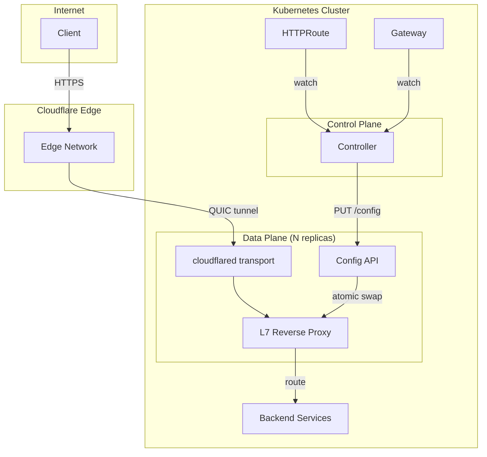

# L7 Proxy Setup

The L7 proxy is the v2 data plane for the Cloudflare Tunnel Gateway Controller.
It runs cloudflared tunnel transport with a built-in reverse proxy that
implements full Gateway API HTTPRoute routing locally, removing most limitations
of the v1 Cloudflare Tunnel ingress API.

## Architecture



## Prerequisites

- Kubernetes 1.25+
- Gateway API CRDs installed
- Cloudflare Tunnel created with a valid token
- Helm 3.x

## Installation

### 1. Create tunnel token Secret

```bash
kubectl create secret generic tunnel-token \
  --from-literal=tunnel-token=YOUR_BASE64_TUNNEL_TOKEN \
  --namespace cloudflare-tunnel-system
```

### 2. Enable proxy in Helm values

```yaml
proxy:
  enabled: true
  replicas: 2
  tunnelTokenSecretRef:
    name: tunnel-token
```

### 3. Install or upgrade

```bash
helm upgrade --install cloudflare-tunnel \
  oci://ghcr.io/lexfrei/charts/cloudflare-tunnel-gateway-controller \
  --namespace cloudflare-tunnel-system \
  --create-namespace \
  --values values.yaml
```

## Features Enabled by L7 Proxy

With the L7 proxy, the following Gateway API features are fully supported:

| Feature | v1 (CF API) | v2 (L7 Proxy) |
| --- | --- | --- |
| Exact path matching | No | Yes |
| Header matching | No | Yes |
| Query parameter matching | No | Yes |
| HTTP method matching | No | Yes |
| Request header modification | No | Yes |
| Response header modification | No | Yes |
| URL rewriting | No | Yes |
| Request redirect | No | Yes |
| Request mirroring | No | Yes |
| Weighted traffic splitting | No | Yes |
| Regex path matching | No | Yes |

## Configuration

The controller automatically discovers proxy pod endpoints via the headless
Service and pushes routing configuration whenever HTTPRoute resources change.

### Environment Variables

The proxy binary accepts the following environment variables:

| Variable | Default | Description |
| --- | --- | --- |
| `TUNNEL_TOKEN` | Required for tunnel mode; omit for standalone/dev mode | Cloudflare tunnel token (base64) |
| `PROXY_CONFIG_ADDR` | `:8081` | Config API listen address |
| `PROXY_ADDR` | `:8080` | Proxy listen address |
| `PROXY_AUTH_TOKEN` | `""` (empty, no auth) | Bearer token for config push API authentication. If unset, the API is unauthenticated. |

### Health Endpoints

| Endpoint | Port | Description |
| --- | --- | --- |
| `/healthz` | Config API | Liveness check |
| `/readyz` | Config API | Readiness (config loaded at least once) |

## Example HTTPRoute

```yaml
apiVersion: gateway.networking.k8s.io/v1
kind: HTTPRoute
metadata:
  name: advanced-routing
spec:
  parentRefs:
    - name: cloudflare-tunnel
  hostnames:
    - app.example.com
  rules:
    - matches:
        - path:
            type: Exact
            value: /api/v2/health
          headers:
            - name: X-API-Version
              value: "2"
          method: GET
      filters:
        - type: ResponseHeaderModifier
          responseHeaderModifier:
            add:
              - name: X-Proxy
                value: cloudflare-tunnel-gateway
      backendRefs:
        - name: api-v2
          port: 8080
          weight: 80
        - name: api-v2-canary
          port: 8080
          weight: 20
```

## Monitoring

The proxy exposes Prometheus metrics on the config API port. Enable the
ServiceMonitor to scrape them automatically:

```yaml
serviceMonitor:
  enabled: true
```

## Troubleshooting

### Proxy pods not becoming ready

Check that the tunnel token is valid:

```bash
kubectl logs --selector app.kubernetes.io/component=proxy \
  --namespace cloudflare-tunnel-system
```

### Routes not updating

Verify the controller can reach the proxy config API:

```bash
kubectl get endpoints --selector app.kubernetes.io/component=proxy \
  --namespace cloudflare-tunnel-system
```

### Config API returns stale version

The controller pushes config atomically. Check controller logs for push errors:

```bash
kubectl logs --selector app.kubernetes.io/name=cloudflare-tunnel-gateway-controller \
  --namespace cloudflare-tunnel-system
```
