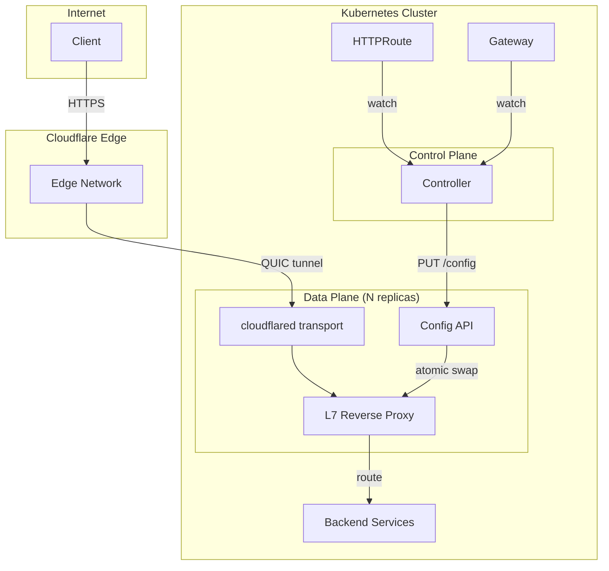

# L7 Proxy Setup

The L7 proxy runs cloudflared tunnel transport with a built-in reverse proxy that implements full Gateway API HTTPRoute routing in-process, removing the limitations of the Cloudflare Tunnel ingress API.

## Architecture



## Prerequisites

- Kubernetes 1.25+
- Gateway API CRDs installed
- Cloudflare Tunnel created with a valid token
- Helm 3.x

## Installation

### 1. Create tunnel token Secret

```bash
kubectl create secret generic tunnel-token \
  --from-literal=tunnel-token=YOUR_BASE64_TUNNEL_TOKEN \
  --namespace cloudflare-tunnel-system
```

### 2. Configure the proxy in Helm values

The L7 proxy is always rendered by the v3 chart. Point it at the tunnel-token Secret and pick a replica count:

```yaml
proxy:
  replicas: 2
  tunnelTokenSecretRef:
    name: tunnel-token
```

### 3. Install or upgrade

```bash
helm upgrade --install cloudflare-tunnel \
  oci://ghcr.io/lexfrei/charts/cloudflare-tunnel-gateway-controller \
  --namespace cloudflare-tunnel-system \
  --create-namespace \
  --values values.yaml
```

## Features Enabled by L7 Proxy

The L7 proxy enables the following Gateway API features that are not available with only the Cloudflare Tunnel API:

- Exact path matching
- Header matching
- Query parameter matching
- HTTP method matching
- Request header modification
- Response header modification
- URL rewriting
- Request redirect
- Request mirroring
- Weighted traffic splitting
- Regex path matching
- Per-route timeouts

## Configuration

The controller automatically discovers proxy pod endpoints via the headless Service and pushes routing configuration whenever HTTPRoute resources change.

### Environment Variables

The proxy binary accepts the following environment variables:

| Variable | Default | Description |
| --- | --- | --- |
| `TUNNEL_TOKEN` | Required for tunnel mode; omit for standalone/dev mode | Cloudflare tunnel token (base64) |
| `PROXY_CONFIG_ADDR` | `:8081` | Config API listen address |
| `PROXY_ADDR` | `:8080` | Proxy listen address |
| `PROXY_AUTH_TOKEN` | `""` (empty, no auth) | Bearer token for config push API authentication. If unset, the API is unauthenticated. |
| `PROXY_METRICS_ENABLED` | `true` | Expose the data-plane Prometheus metrics at `/metrics` on the config API port. Set `false`/`0` to disable. |
| `PROXY_GRACE_PERIOD` | `30s` | Connector drain window on shutdown (Go duration, capped at 3m): the proxy unregisters from the edge and gives in-flight requests this long before exiting. |
| `PROXY_TUNNEL_PROTOCOL` | `auto` | Edge transport: `auto`, `http2`, or `quic`. gRPC needs `http2` (QUIC drops trailers); `auto` is upgraded to `http2` by the proxy. |
| `PROXY_TUNNEL_PROTOCOL_WAIT` | `0` (no wait) | In `auto` mode, how long (Go duration) to wait for the first pushed config before serving, so the protocol is chosen from real routes. |
| `PROXY_WS_DIAL_TIMEOUT` | `""` (proxy default 30s) | Go-duration cap on the backend dial during a WebSocket upgrade. |
| `PROXY_WS_HANDSHAKE_TIMEOUT` | `""` (proxy default 30s) | Go-duration cap on waiting for the backend's `101 Switching Protocols`. |
| `PROXY_ACCESS_LOG_ENABLED` | `false` | Enable per-request structured JSON access logging on stdout. |
| `PROXY_ACCESS_LOG_SAMPLING_RATE` | `1` | Fraction of non-5xx requests to log when access logging is enabled, in `[0, 1]` (5xx are always logged). |
| `PROXY_ACCESS_LOG_STRIP_QUERY` | `false` | Strip the request URL query string from access-log lines. |
| `PROXY_TRACING_ENABLED` | `false` | Enable OpenTelemetry tracing of proxied requests. |
| `PROXY_TRACING_ENDPOINT` | `""` | OTLP exporter endpoint for traces (when tracing is enabled). |
| `PROXY_TRACING_SAMPLE_RATE` | `1` | Trace sampling fraction in `[0, 1]` (when tracing is enabled). |

### Health Endpoints

| Endpoint | Port | Description |
| --- | --- | --- |
| `/healthz` | Config API | Liveness check |
| `/readyz` | Config API | Readiness: config loaded at least once AND, in tunnel mode, the tunnel has connected to the Cloudflare edge (standalone mode latches the tunnel condition at startup) |

## Example HTTPRoute

```yaml
apiVersion: gateway.networking.k8s.io/v1
kind: HTTPRoute
metadata:
  name: advanced-routing
spec:
  parentRefs:
    - name: cloudflare-tunnel
  hostnames:
    - app.example.com
  rules:
    - matches:
        - path:
            type: Exact
            value: /api/v2/health
          headers:
            - name: X-API-Version
              value: "2"
          method: GET
      filters:
        - type: ResponseHeaderModifier
          responseHeaderModifier:
            add:
              - name: X-Proxy
                value: cloudflare-tunnel-gateway
      backendRefs:
        - name: api-v2
          port: 8080
          weight: 80
        - name: api-v2-canary
          port: 8080
          weight: 20
```

## Monitoring

The proxy does not expose a Prometheus `/metrics` endpoint — its config API serves only `GET /config`, `PUT /config`, `GET /healthz`, and `GET /readyz`. Prometheus metrics are emitted by the controller, which exposes `/metrics` on its dedicated metrics port (via controller-runtime).

Setting `serviceMonitor.enabled: true` renders two ServiceMonitors: one targeting the controller's `metrics` port (the real Prometheus endpoint) and one targeting the proxy's `config-api` port (health and config API only — there is nothing to scrape there yet):

```yaml
serviceMonitor:
  enabled: true
```

## Troubleshooting

### Proxy pods not becoming ready

Check that the tunnel token is valid:

```bash
kubectl logs --selector app.kubernetes.io/component=proxy \
  --namespace cloudflare-tunnel-system
```

### Routes not updating

Verify the controller can reach the proxy config API:

```bash
kubectl get endpoints --selector app.kubernetes.io/component=proxy \
  --namespace cloudflare-tunnel-system
```

### Config API returns stale version

The controller pushes config atomically. Check controller logs for push errors:

```bash
kubectl logs --selector app.kubernetes.io/name=cloudflare-tunnel-gateway-controller \
  --namespace cloudflare-tunnel-system
```
